# Module 1: Introduction

See this [GitHub page](https://github.com/DataTalksClub/mlops-zoomcamp/tree/main/01-intro) 
on [DataTalksClub/mlops-zoomcamp](https://github.com/DataTalksClub/mlops-zoomcamp).

## 1.1 Introduction

:movie_camera: [Youtube](https://www.youtube.com/watch?v=s0uaFZSzwfI&list=PL3MmuxUbc_hIUISrluw_A7wDSmfOhErJK&index=2).

MLOps stands for Machine Learning Operations. MLOps is a core function of Machine Learning engineering, focused on streamlining the process 
of taking machine learning models to production, and then maintaining and monitoring them. See 
[What is MLOps?](https://www.databricks.com/glossary/mlops) from Databricks for more.


See also [Machine Learning Operations](https://ml-ops.org/) from INNOQ.

## 1.2 Environment preparation (Linux/macOS)

:movie_camera: [Youtube](https://www.youtube.com/watch?v=IXSiYkP23zo&list=PL3MmuxUbc_hIUISrluw_A7wDSmfOhErJK&index=3).

In this section, we will learn how to prepare our environment in AWS.

### Create AWS account

Go to [AWS Management Console](https://aws.amazon.com/console/), click on **Create an AWS Account** and follow steps.

Select your **Default Region** (mine is `Canada (Central) ca-central-1`).

### Create AWS EC2 instance

> [00:45](https://www.youtube.com/watch?v=IXSiYkP23zo&list=PL3MmuxUbc_hIUISrluw_A7wDSmfOhErJK&index=3&t=45s) Create EC2 Instance

From your **AWS Console**, select **EC2** and then click on **Launch instance**.

Create a new instance `mlops-zoomcamp` with **Ubuntu**, **64-bit (x86)** architecture,

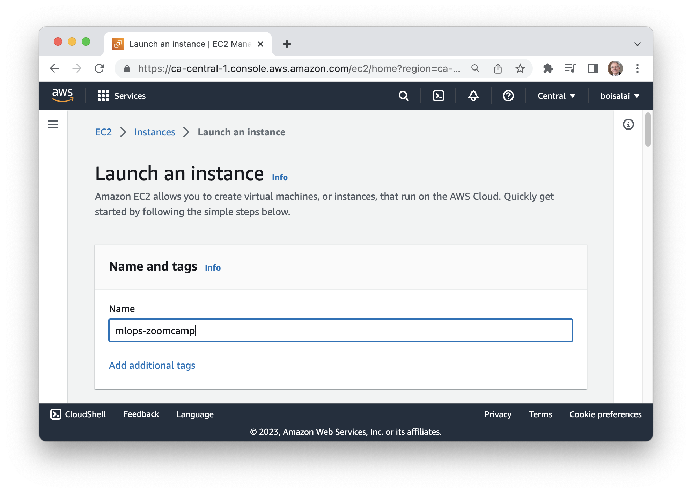

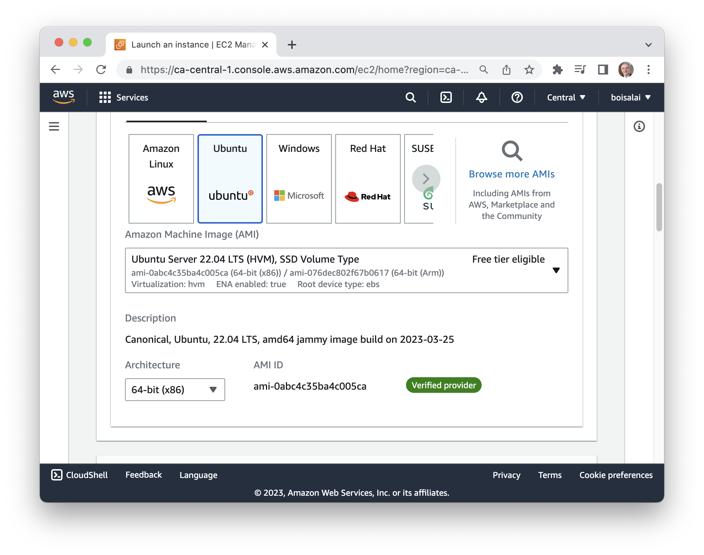

Select **t2.xlarge** instance type.

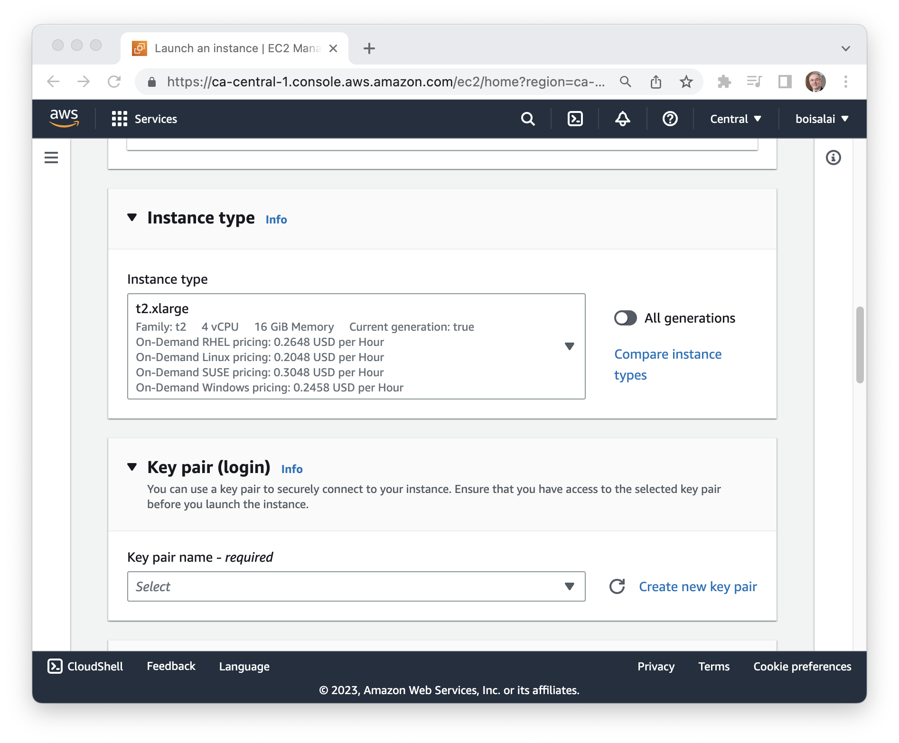

Click on **Create new key pair**.

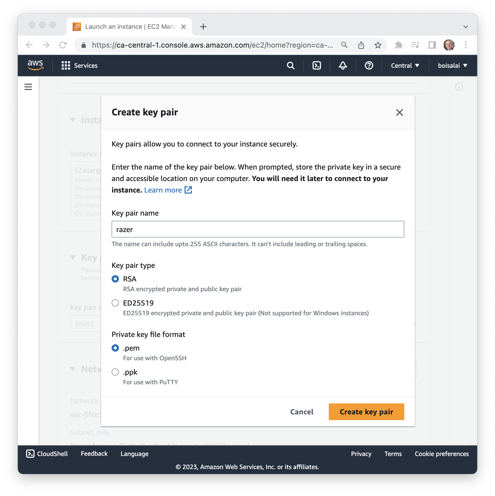

Name the key pair (mine is `razer`), select **RSA** key pair type and **`.pem`** private key file format.

Click on **Create key pair** button, than move the downloaded `razer.pem`  file to the `~/.ssh` folder.

Increase **Configure storage** to 30 Gb

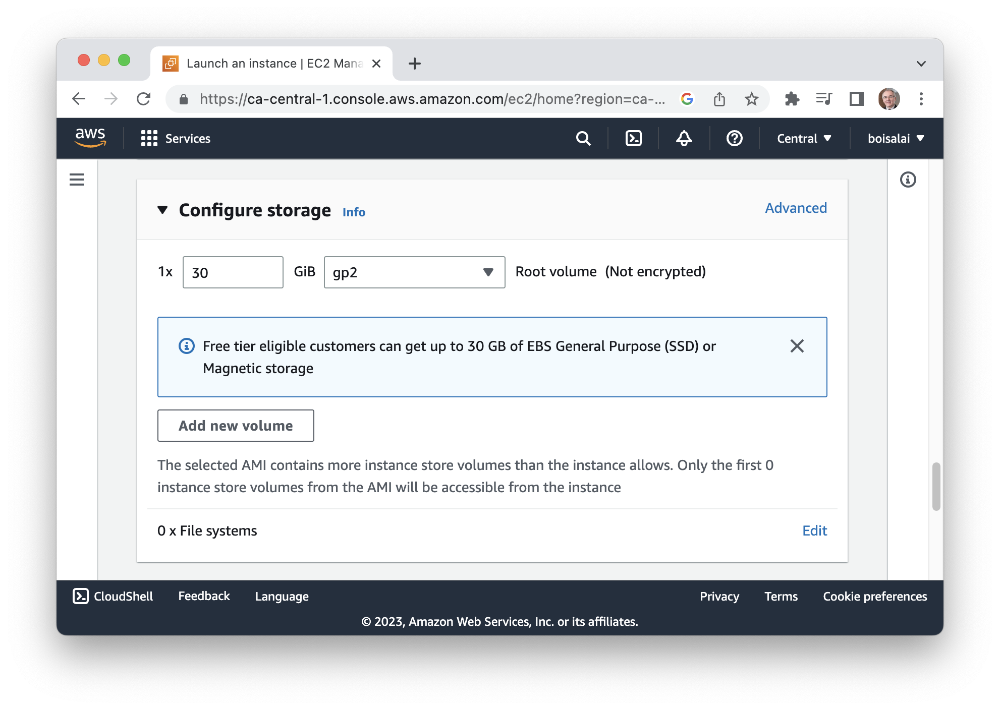

Finally, click the **Launch instance** button.

You should see something like this.

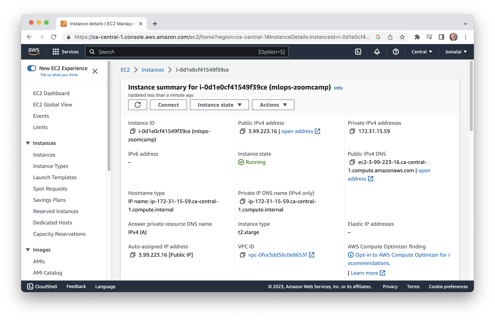

Take note of the public IP address (mine is `3.99.223.16`).

### Connect local machine to the EC2 instance

> [03:27](https://www.youtube.com/watch?v=IXSiYkP23zo&list=PL3MmuxUbc_hIUISrluw_A7wDSmfOhErJK&index=3&t=207s) Connect local machine to the EC2 instance

Connect to this instance with this command.
Don't forget to replace the public IP with your own (mine is `3.99.223.16`).

```bash
ssh -i ~/.ssh/razer.pem ubuntu@3.99.223.16 
```

I'm getting the **unprotected private key file** error.

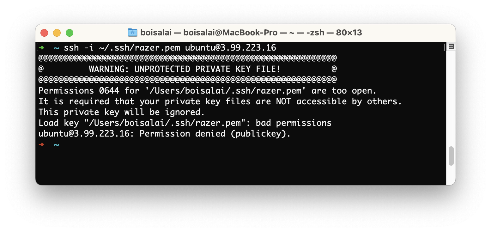

In this [page](https://99robots.com/how-to-fix-permission-error-ssh-amazon-ec2-instance/), 
we learn how to fix this error. Basically, you need to change the file permissions of the key file.

```bash
chmod 400 ~/.ssh/razer.pem 
```

Run the ssh command again and you should get this.

```bash
ssh -i ~/.ssh/razer.pem ubuntu@3.99.223.16 
```

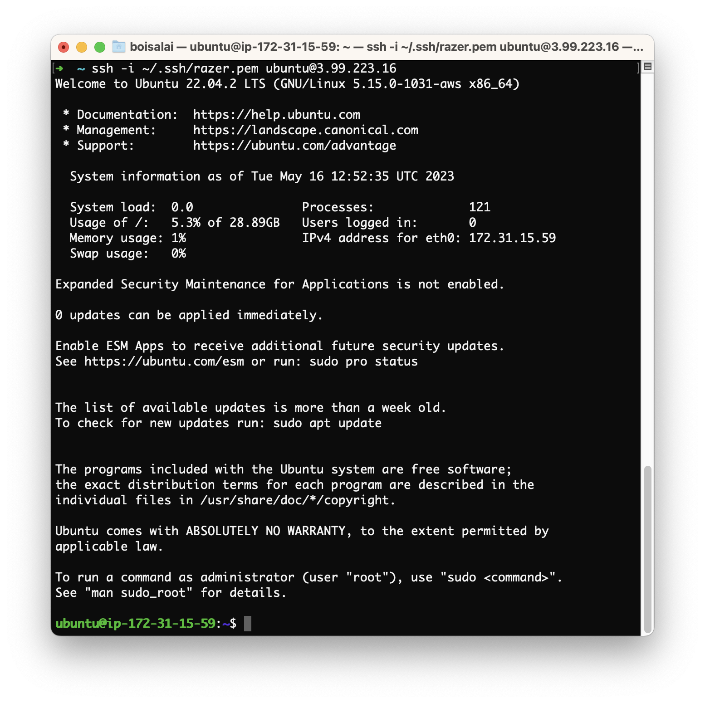

We are now connected to the remote service.

Enter `logout` to close the connection.

> [03:59](https://www.youtube.com/watch?v=IXSiYkP23zo&list=PL3MmuxUbc_hIUISrluw_A7wDSmfOhErJK&index=3&t=239s) Give alias to Host

You don't need to run the previous command every time. Just create a config file `~/.ssh/config` like this.

```bash
Host mlops-zoomcamp
    HostName 3.99.223.16
    User ubuntu
    IdentityFile ~/.ssh/razer.pem
    StrictHostKeyChecking no
```

Every time we restart the instance, we will have to change the public IP address.

Now, we can connect to our instance with this command.

```bash
ssh mlops-zoomcamp
```

The next page explains how to always keep the same IP address.
See [Reserve External Static Address](https://github.com/syahrulhamdani/dtc-mlops/blob/main/week-1-introduction/README.md#reserve-external-static-address) 
from [Syahrul Bahar Hamdani](https://github.com/syahrulhamdani).

### Install Anaconda

> [05:25](https://www.youtube.com/watch?v=IXSiYkP23zo&list=PL3MmuxUbc_hIUISrluw_A7wDSmfOhErJK&index=3&t=325s) Install Anaconda

We do not have anything on this remote instance. 
We now need to install some packages.

Go to https://www.anaconda.com/download/ to get the latest version of Anaconda.
Copy the link for **Linux 64-Bit (x86) Installer**.
Run this command on the remote instance.

```bash
wget https://repo.anaconda.com/archive/Anaconda3-2022.05-Linux-x86_64.sh
bash Anaconda3-2022.05-Linux-x86_64.sh
```

Installation takes some time.

### Install Docker on Linux

> [06:40](https://www.youtube.com/watch?v=IXSiYkP23zo&list=PL3MmuxUbc_hIUISrluw_A7wDSmfOhErJK&index=3&t=400s) Install Docker and Docker-Compose

Open a new terminal window, connect to your remote instance again and install docker.

```bash
sudo apt update 
sudo apt install docker.io
```

In addition to Docker, we also will need Docker Compose. 

Install Docker Compose in a separate directory on our instance.
Go to https://github.com/docker/compose/releases and copy the link of `docker-compose-linux-x86_64`.

```bash
mkdir soft
cd soft
wget https://github.com/docker/compose/releases/download/v2.17.3/docker-compose-linux-x86_64 -O docker-compose
chmod +x docker-compose
```

### Modify Path Variable

> [08:13](https://www.youtube.com/watch?v=IXSiYkP23zo&list=PL3MmuxUbc_hIUISrluw_A7wDSmfOhErJK&index=3&t=493s) Modify Path Variable

Add the soft directory to PATH. Open the `.bashrc` file with `nano ~/.bashrc`
and add the following line:

```bash
export PATH="${HOME}/soft:${PATH}"
```

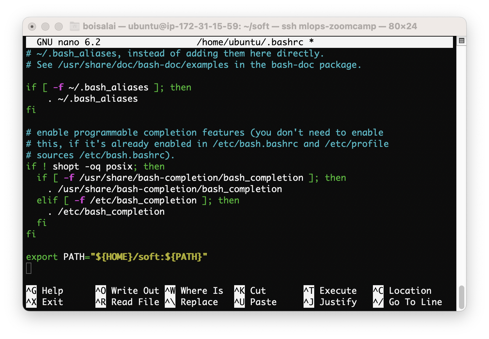

Save it (`Ctrl+O` to save and `Ctrl+X` to exit) and run the following commands to make sure the changes are applied.

```bash
cd 
source .bashrc
which docker-compose
# /home/ubuntu/soft/docker-compose
```

### Add user to the Docker group

> [09:00](https://www.youtube.com/watch?v=IXSiYkP23zo&list=PL3MmuxUbc_hIUISrluw_A7wDSmfOhErJK&index=3&t=540s) Add user to the docker group

We need to add our user to docker group.

```bash
sudo usermod -aG docker $USER
```

Log out (with `logout` command) and log back (with `ssh mlops-zoomcamp` command) 
in so that your group membership is re-evaluated.

Run the following command and docker should work fine.

```bash
docker run hello-world
```

### Init Anaconda

> [10:03](https://www.youtube.com/watch?v=IXSiYkP23zo&list=PL3MmuxUbc_hIUISrluw_A7wDSmfOhErJK&index=3&t=603s) Init Anaconda

Once Anaconda has finished its installation, we must initialize it.
Answer `yes` to the question `Do you wish the installer to initialize Anaconda3 by running conda init?`.

We need also log out (with `logout` command) and log back (with `ssh mlops-zoomcamp` command) before
check where Python is installed and see what Anaconda has changed.

```bash
which python
# /home/ubuntu/anaconda3/bin/python
python
# Python 3.9.12 (main, Apr  5 2022, 06:56:58) 
# [GCC 7.5.0] :: Anaconda, Inc. on linux
# Type "help", "copyright", "credits" or "license" for more information.
# >>> 
less .bashrc
```

### Clone mlops-zoomcamp GitHub repo

> [10:50](https://www.youtube.com/watch?v=IXSiYkP23zo&list=PL3MmuxUbc_hIUISrluw_A7wDSmfOhErJK&index=3&t=650s) Clone mlops-zoomcamp GitHub repo

Now, we will clone the repo of the course.

```bash
git clone https://github.com/DataTalksClub/mlops-zoomcamp.git
cd mlops-zoomcamp
```

### Connect VS code with remote machine

> [11:48](https://www.youtube.com/watch?v=IXSiYkP23zo&list=PL3MmuxUbc_hIUISrluw_A7wDSmfOhErJK&index=3&t=708s) connect VS code with remote machine

Now, we want access to this remote computer from our Visual Studio Code (VS Code).

Open VS Code from your local machine. 
In VS Code, find and install the **Remote - SSH** extension. 
Then go to the **Command Palette** (`Shift+Cmd+P`) and select **Remote-SSH: Connect to Host…**​ and `mlops-zoomcamp`.

We should see this.


### Use Jupyter Notebook from remote machine (13:10)

> [13:10](https://www.youtube.com/watch?v=IXSiYkP23zo&list=PL3MmuxUbc_hIUISrluw_A7wDSmfOhErJK&index=3&t=790s) Use Jupyter Notebook from remote machine

On the remote instance, run the following commands.

```bash
cd
mkdir notebooks
jupyter notebook
```

In VS Code, open terminal, select **PORTS**, open the port `8888`

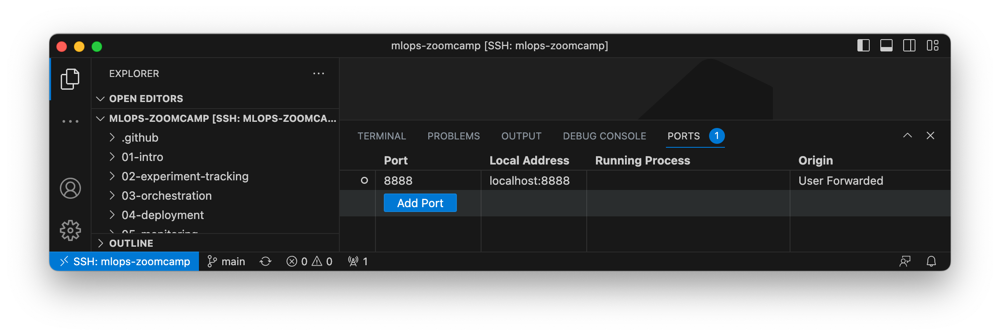

Now, if we go to http://localhost:8888/tree, we should see that jupyter notebook is alive.

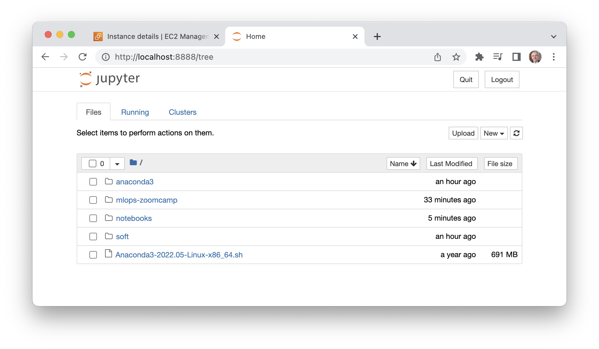

### Additional materials

#### Install pyenv instead of Anaconda

We may prefer [pyenv](https://github.com/pyenv/pyenv) and pipenv for managing python 
version and virtual environment. 
Anaconda could be just to heavy and not reliable for us.

The instructions below for [pyenv](https://github.com/pyenv/pyenv)
are from [Using pyenv instead of Anaconda](https://github.com/syahrulhamdani/dtc-mlops/blob/main/week-1-introduction/README.md#using-pyenv-instead-of-anaconda) from 
[Syahrul Bahar Hamdani](https://github.com/syahrulhamdani).

If you want it, you can follow these steps:

* if you love being hardcore, follow the installation steps with git 
in the official [docs](https://github.com/pyenv/pyenv#basic-github-checkout)
* if you want fast installation, use [pyenv-installer](https://github.com/pyenv/pyenv-installer)
* after that, continue to follow the instructions in pyenv official installation 
guide for [shell environment](https://github.com/pyenv/pyenv#set-up-your-shell-environment-for-pyenv)
* don't forget to `source` your `.profile` file (or `.bash_profile`, `.zshrc`, etc.)

Before installing specific python version, first you need to install some python dependencies.
Just follow this [wiki](https://github.com/pyenv/pyenv/wiki#suggested-build-environment) 
and look for Ubuntu suggested build.

For this bootcamp, I use **Python 3.9.12** (no specific reason). The command used 
to install that version with pyenv:

```bash
pyenv install 3.9.12
```

If you want other versions, you can look at the available list by using command:

```bash
pyenv install --list
```

You can even install more than one python version using pyenv.

Last command to use the python version is to make it as global python version. Use:

```bash
pyenv global 3.9.12
```

For sanity check, type `python` and you should be entering Python 3.9.12 interface. 
Or, you can use command `pyenv which python`.
To check the list of python versions you already installed, just run `pyenv versions`.

To create a virtual environment using pyenv, just type:

```bash
pyenv virtualenv [version] [env_name]
```

For example, if I want to create a virtual environment using Python 3.9.7 and 
name it as `mlops-zoomcamp`, I just type:

```bash
pyenv virtualenv 3.9.7 mlops-zoomcamp
```

To activate it, I suggest you don't. You can use it directly in you desired 
workspace by attach it as local environment.
For example, if you want to use the environment in mlops-zoomcamp directory, 
just `cd` inside it, and run command below:

```bash
pyenv local mlops-zoomcamp
```

Every time you enter the directory, the virtual environment will be activated automatically.

See also:

* [Pipenv Cheat sheet](https://gist.github.com/ziritrion/8024025672ea92b8bdeb320d6015aa0d#pipenv) from [Alvaro Navas](https://gist.github.com/ziritrion).

#### Install Docker on macOS

Install Docker with Docker Compose already included.
Note that `--cask` flag installs modules into `/usr/local` directory.

```bash
brew install docker --cask
```

Run Docker.

```bash
docker run hello-world
```

#### Add an Anaconda env as Jupyter kernel

```bash
conda activate base
conda install -c anaconda ipykernel
python -m ipykernel install --user --name base-anaconda --display-name "(base) Anacoda Py 3.9.12"
jupyter kernelspec list
jupyter notebook
```

#### Upload/download files to/from your instance

1. Download a file.

    ```sh
    # From your local machine
    scp <instance_name>:path/to/remote/file path/to/local/file
    ```

1. Upload a file.

    ```sh
    # From your local machine
    scp path/to/local/file <instance_name>:path/to/remote/file
    ```

1. You can also drag & drop stuff in VSCode with the [remote SSH](https://marketplace.visualstudio.com/items?itemName=ms-vscode-remote.remote-ssh) extension.

1. If you use a client like [https://cyberduck.io/](Cyberduck), you can connect with SFTP to your instance using the `instance.zone.project` name as server, and adding the generated private ssh key.

See also [How to Use SCP Command to Securely Transfer Files](https://linuxize.com/post/how-to-use-scp-command-to-securely-transfer-files/)

## 1.3 Reading Parquet files instead of CSV

:movie_camera: [Youtube](https://www.youtube.com/watch?v=r94QjpX9vSE&list=PL3MmuxUbc_hIUISrluw_A7wDSmfOhErJK&index=4).

### Intro and the change in the dataset

We will use [TLC Trip Record Data](https://www.nyc.gov/site/tlc/about/tlc-trip-record-data.page).

In jupyter notebook running on the remote instance, we need to install missing dependency on the remote instance.

```python
!pip install pyarrow
```

Below, the code to read a parquet file.

```python
import pandas as pd

!wget -P data https://d37ci6vzurychx.cloudfront.net/trip-data/yellow_tripdata_2021-01.parquet

df = pd.read_parquet("./data/yellow_tripdata_2021-01.parquet")
df.dtypes
```

We should see this.


## 1.3 (Optional) Training a ride duration prediction model

:movie_camera: [Youtube](https://www.youtube.com/watch?v=iRunifGSHFc&list=PL3MmuxUbc_hIUISrluw_A7wDSmfOhErJK&index=5).

See [duration-prediction.ipynb](notebooks/duration-prediction.ipynb).

## 1.4 Course overview

:movie_camera: [Youtube](https://www.youtube.com/watch?v=teP9KWkP6SM&list=PL3MmuxUbc_hIUISrluw_A7wDSmfOhErJK&index=6).

**Experiment Tracking** is the process of managing all the different experiments and their components, 
such as parameters, metrics, models and other artifacts and it enables us to:

A **Model Registry**  is a centralized model store, set of APIs, and UI, to 
collaboratively manage the full lifecycle of an Model.

One definition of an **ML pipeline** is a means of automating the machine learning workflow by enabling data to be transformed and
correlated into a model that can then be analyzed to achieve outputs. This type of ML pipeline makes the process of inputting data
into the ML model fully automated.

See also:

* [Experiment Tracking](https://madewithml.com/courses/mlops/experiment-tracking/)
* [MLflow Model Registry](https://mlflow.org/docs/latest/model-registry.html)
* [ML Model Registry: What It Is, Why It Matters, How to Implement It](https://neptune.ai/blog/ml-model-registry)
* [ML Pipelines](https://www.databricks.com/glossary/what-are-ml-pipelines) from Databricks
* [MyMLOps](https://mymlops.com/builder)

## 1.5 MLOps maturity model

:movie_camera: [Youtube](https://www.youtube.com/watch?v=XwTH8BDGzYk&list=PL3MmuxUbc_hIUISrluw_A7wDSmfOhErJK&index=7).

See [MLOps Maturity model](https://docs.microsoft.com/en-us/azure/architecture/example-scenario/mlops/mlops-maturity-model).

## 1.6 Homework

See [questions](https://github.com/DataTalksClub/mlops-zoomcamp/blob/main/cohorts/2023/01-intro/homework.md).

Q1 = 19
Q2 = 46.45
Q3 = 98% 
Q4 = 515
Q5= 6.99
Q6 = 7.79