# Module 2: Experiment tracking and model management

See this [GitHub page](https://github.com/DataTalksClub/mlops-zoomcamp/tree/main/02-experiment-tracking) 
on [DataTalksClub/mlops-zoomcamp](https://github.com/DataTalksClub/mlops-zoomcamp).

## 2.1 Experiment tracking intro

:movie_camera: [Youtube](https://www.youtube.com/watch?v=MiA7LQin9c8&list=PL3MmuxUbc_hIUISrluw_A7wDSmfOhErJK&index=11).

### Presentation starts, concept introduction

> [00:21](https://www.youtube.com/watch?v=MiA7LQin9c8&list=PL3MmuxUbc_hIUISrluw_A7wDSmfOhErJK&index=11&t=21s) Presentation starts, concept introduction

Important concepts

* ML experiment: the process of building an ML model
* Experiment run: each trial in an ML experiment
* Run artifect: any file that is associated with an ML run
* Experiment metadata

### Experiment tracking

> [01:15](https://www.youtube.com/watch?v=MiA7LQin9c8&list=PL3MmuxUbc_hIUISrluw_A7wDSmfOhErJK&index=11&t=75s) Experiment tracking

What's experiment tracking?

Experiment tracking is the process of keeping track of all the **relevant information**
from a **ML experiment**, which includes source code, environment, data, model, hyperparameters, metrics... of a series of runs.

### Why is experiment tracking so important?

> [02:20](https://www.youtube.com/watch?v=MiA7LQin9c8&list=PL3MmuxUbc_hIUISrluw_A7wDSmfOhErJK&index=11&t=140s) Why is experiment tracking so important?

Why is experiment tracking so important? In general, because of these 3 main reasons:

* Reproducibility
* Organization
* Optimization

During the model development stage, a data scientist could run multiple runs of the same experiment or multiple experiments depending on the project scenarios.
A good reference for designing ML experiments can be found at https://machinelearningmastery.com/controlled-experiments-in-machine-learning/.

### Tracking experiments in spreadsheets

> [03:53](https://www.youtube.com/watch?v=MiA7LQin9c8&list=PL3MmuxUbc_hIUISrluw_A7wDSmfOhErJK&index=11&t=233s) Tracking experiments in spreadsheets

### MLFlow

> [06:04](https://www.youtube.com/watch?v=MiA7LQin9c8&list=PL3MmuxUbc_hIUISrluw_A7wDSmfOhErJK&index=11&t=364s) MLFlow

[MLflow](https://mlflow.org/) MLflow is a versatile, expandable, open-source platform for managing workflows and artifacts across the machine learning lifecycle. 
It has built-in integrations with many popular ML libraries, but can be used with any library, algorithm, or deployment tool. It is designed 
to be extensible, so you can write plugins to support new workflows, libraries, and tools.


MLflow offers four components:

* MLflow [Tracking](https://mlflow.org/docs/latest/tracking.html): Record and query experiments—code, data, configuration parameters and results.
* MLflow [Projects](https://mlflow.org/docs/latest/projects.html): Package data science code in a format to reproduce runs on any platform.
* MLflow [Models](https://mlflow.org/docs/latest/models.html): Deploy machine learning models in diverse serving environments.
* Model [Registry](https://mlflow.org/docs/latest/model-registry.html): Store, annotate, discover and manage models in a central repository.

MLflow Tracking provides a solution that can be scaled from your local machine to the entire enterprise. 
This allows data scientists to get started on their local machine while organizations can implement a solution that ensures 
long term maintainability and transparency in a central repository.

MLflow Tracking provides consistent and transparent tracking by:

* Tracking parameters and the corresponding results for the modeling experiments programmatically and comparing them using a user interface.
* Recovering the model having the best results along with its corresponding code for different metrics of interest across experiments for different projects.
* Looking back through time to find experiments conducted with certain parameter values.
* Enabling team members to experiment and share results collaboratively.
* Exposing the status of multiple projects in a singular interface for management along with all their details (parameters, output plots, metrics, etc.).
* Allowing tracking across runs and parameters through a single notebook, reducing time spent managing code and different notebook versions.
* Providing an interface for tracking both Python and R based experiments.

### Tracking experiments with MLFlow

> [07:46](https://www.youtube.com/watch?v=MiA7LQin9c8&list=PL3MmuxUbc_hIUISrluw_A7wDSmfOhErJK&index=11&t=466s) Tracking experiments with MLFlow

There are two main concepts in MLflow tracking: experiments and runs. The data logged during an experiment is recorded as a run in MLflow. 
The runs can be organized into experiments, which groups together runs for a specific task. One can visualize, search, compare, and download 
run artifacts and metadata for the runs logged in an MLflow experiment.

So, the [MLflow Tracking](https://mlflow.org/docs/latest/tracking.html) module allows you to organize your experiments into runs, and to keep track of:

* Parameters
* Metrics
* Metadata
* Artifacts
* Models

Along with this information, MLflow automatically logs extra information about the run:

* Source code
* Version of the code (`git commit`)
* Start and end time
* Author

See also :

* [MLflow Documentation](https://mlflow.org/docs/latest/index.html)
* [MLflow Quickstart Tutorial](https://mlflow.org/docs/latest/quickstart.html#quickstart)
* [MLflow Tracking](https://mlflow.org/docs/)
* [MLflow Tracking: An efficient way of tracking modeling experiments](https://www.statcan.gc.ca/en/data-science/network/mlflow-tracking) from Statistics Canada

### MLFlow demo

> [11:06](https://www.youtube.com/watch?v=MiA7LQin9c8&list=PL3MmuxUbc_hIUISrluw_A7wDSmfOhErJK&index=11&t=666s) MLFlow demo

The instructor launches the MLflow tracking UI with this commands and introduce the user interface.

```bash
mlflow ui
```

## 2.2 Getting started with MLflow

:movie_camera: [Youtube](https://www.youtube.com/watch?v=cESCQE9J3ZE&list=PL3MmuxUbc_hIUISrluw_A7wDSmfOhErJK&index=12).

### Creating conda environment

> [00:46](https://www.youtube.com/watch?v=cESCQE9J3ZE&list=PL3MmuxUbc_hIUISrluw_A7wDSmfOhErJK&index=12&t=46s) Creating conda environment

Here, we will set up MLflow locally to interact with a local MLflow tracking server.

In the `02-experiment-tracking`folder, we have the `requirements.txt` file with these dependecies.

```txt
mlflow
jupyter
scikit-learn
pandas
seaborn
hyperopt
xgboost
fastparquet
boto3
```

Before install these packages, it's a good practice to create a conda environment.
On your local machine, run the following commands to create a new environment.

```bash
cd 
git clone https://github.com/DataTalksClub/mlops-zoomcamp.git
cd mlops-zoomcamp 
conda create -n exp-tracking-env python=3.9
conda activate exp-tracking-env
```

### Installing MLflow with pip

> [01:02](https://www.youtube.com/watch?v=cESCQE9J3ZE&list=PL3MmuxUbc_hIUISrluw_A7wDSmfOhErJK&index=12&t=62s) Installing MLflow with pip

On your local machine, install required packages, including MLflow, with this command.

```bash
cd 02-experiment-tracking 
pip install -r requirements.txt
```

You can verify your MLflow installation locally with the following command.

```bash
mlflow --version
# mlflow, version 2.3.2
```

This confirms that we have installed version 2.3.2 of MLflow on our local development environment.

Start MLflow with this command.

```bash
mlflow
```

You should see this in the terminal.

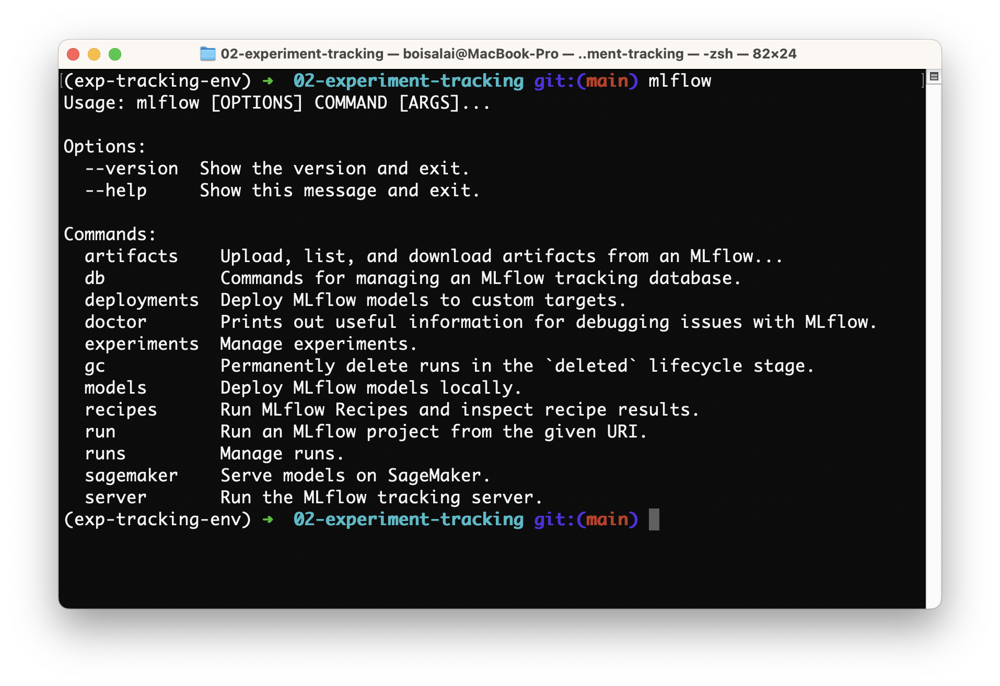

### Running MLflow

> [01:42](https://www.youtube.com/watch?v=cESCQE9J3ZE&list=PL3MmuxUbc_hIUISrluw_A7wDSmfOhErJK&index=12&t=102s) Running MLflow

MLflow runs can be recorded to local files, to a SQLAlchemy-compatible database, or remotely to a tracking server. 
By default, the MLflow Python API logs runs locally to files in an mlruns directory wherever you ran your program.

The backend store is where MLflow Tracking Server stores experiment and run metadata as well as params, metrics, and tags for runs. MLflow supports 
two types of backend stores: *file store* and *database-backed* store.

Run the following commands to launch the MLflow UI with a sqlite backend store.

```bash
mlflow ui --backend-store-uri sqlite:///mlflow.db
```

Following this, you will see that the UI web server is running.

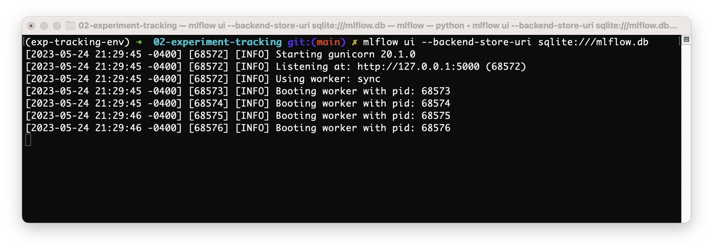

This will open the UI on http://127.0.0.1:5000/. You should see this.

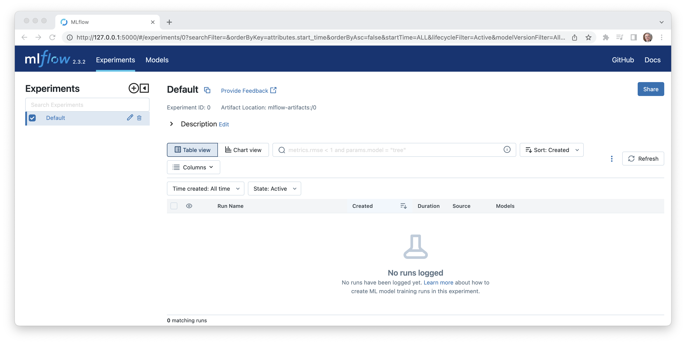

Since this is a new MLflow installation, there is onfly one **Default** experiment with no runs under it yet.

### Importing MLflow in jupyter notebook

> [03:48](https://www.youtube.com/watch?v=cESCQE9J3ZE&list=PL3MmuxUbc_hIUISrluw_A7wDSmfOhErJK&index=12&t=228s) Importing MLflow in jupyter notebook

Open VS Code from the terminal.

```bash
cd mlops-zoomcamp
code .
```

In VS Code, open the `02-experiment-tracking/duration-prediction.ipynb` notebook, 
click on **Select Kernel**, select **Python Environments...**, and select `exp-tracking-env` kernel.

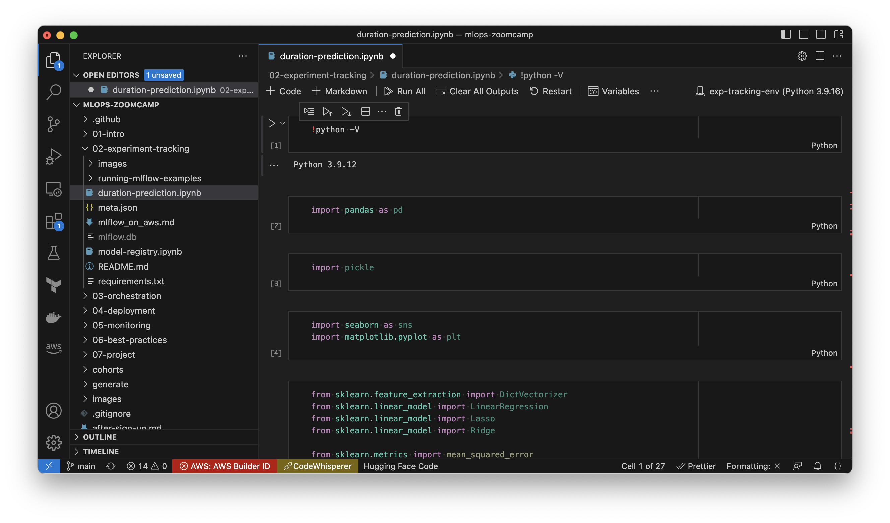

Run the following instructions from the notebook.

```python
import pandas as pd
import pickle

import seaborn as sns
import matplotlib.pyplot as plt

from sklearn.feature_extraction import DictVectorizer
from sklearn.linear_model import LinearRegression
from sklearn.linear_model import Lasso
from sklearn.linear_model import Ridge

from sklearn.metrics import mean_squared_error
```

We need to import MLflow module and to set the tracking server URU using the `MLFLOW_TRACKING_URI`
environment variable.

By default, MLflow stores the tracking data locally. Generally, you will want to use shared storage. Locally, MLflow stores tracking data 
and artifacts in an `mlruns/` subdirectory of where you ran the code. 

You may also store your data remotely. You can track your runs with a tracking server, on a shared filesystem, with a 
SQLAlchemy-compatible database, or in a Databricks workspace. To log to a tracking server, set the `MLFLOW_TRACKING_URI` 
environment variable to the server's URI or call `mlflow.set_tracking_uri()`.

See [Share MLflow runs and experiments](https://mlflow.org/docs/latest/quickstart.html#share-mlflow-runs-and-experiments) for more information.

For now, the line `mlflow.set_tracking_uri("sqlite:///mlflow.db")` will log the artifacts of the MLflow runs in the SQLite DB, locally.

```python
import mlflow

mlflow.set_tracking_uri("sqlite:///mlflow.db")
```

We need to set up an active experiment using `mlflow.set_experiment`.

```python
EXPERIMENT_NAME = "nyc-taxi-experiment"
mlflow.set_experiment(EXPERIMENT_NAME)
# 2023/05/16 17:53:17 INFO mlflow.tracking.fluent: Experiment with name 
# 'nyc-taxi-experiment' does not exist. Creating a new experiment.
# <Experiment: artifact_location='/Users/boisalai/GitHub/mlops-zoomcamp/02-experiment-tracking/mlruns/1', 
# creation_time=1684273997625, experiment_id='1', last_update_time=1684273997625, lifecycle_stage='active', 
# name='nyc-taxi-experiment', tags={}>

experiment = mlflow.get_experiment_by_name(EXPERIMENT_NAME)
print(f"experiment_id={experiment.experiment_id}")
```

Download the TLC Taxi Trip datasets.

```python
!wget -P ./data https://d37ci6vzurychx.cloudfront.net/trip-data/green_tripdata_2021-01.parquet
!wget -P ./data https://d37ci6vzurychx.cloudfront.net/trip-data/green_tripdata_2021-02.parquet
```

Load the data.

```python
def read_dataframe(filename):
    df = pd.read_parquet(filename)

    df.lpep_dropoff_datetime = pd.to_datetime(df.lpep_dropoff_datetime)
    df.lpep_pickup_datetime = pd.to_datetime(df.lpep_pickup_datetime)

    df['duration'] = df.lpep_dropoff_datetime - df.lpep_pickup_datetime
    df.duration = df.duration.apply(lambda td: td.total_seconds() / 60)

    df = df[(df.duration >= 1) & (df.duration <= 60)]

    categorical = ['PULocationID', 'DOLocationID']
    df[categorical] = df[categorical].astype(str)
    
    return df

df_train = read_dataframe('./data/green_tripdata_2021-01.parquet')
df_val = read_dataframe('./data/green_tripdata_2021-02.parquet')

len(df_train), len(df_val)
# (73908, 61921)
```

### Model training

> [05:32](https://www.youtube.com/watch?v=cESCQE9J3ZE&list=PL3MmuxUbc_hIUISrluw_A7wDSmfOhErJK&index=12&t=332s) Model training

Train the data.

```python
df_train['PU_DO'] = df_train['PULocationID'] + '_' + df_train['DOLocationID']
df_val['PU_DO'] = df_val['PULocationID'] + '_' + df_val['DOLocationID']

categorical = ['PU_DO'] 
numerical = ['trip_distance']

dv = DictVectorizer()

train_dicts = df_train[categorical + numerical].to_dict(orient='records')
X_train = dv.fit_transform(train_dicts)

val_dicts = df_val[categorical + numerical].to_dict(orient='records')
X_val = dv.transform(val_dicts)

target = 'duration'
y_train = df_train[target].values
y_val = df_val[target].values

lr = LinearRegression()
lr.fit(X_train, y_train)
```

Validate the model.

```python
y_pred = lr.predict(X_val)

mean_squared_error(y_val, y_pred, squared=False)
# 7.758715206931833
```

Store the model to a file.

```python
!mkdir models

with open('models/lin_reg.bin', 'wb') as f_out:
    pickle.dump((dv, lr), f_out)
```

### Model training of different versions with MLflow

> [06:10](https://www.youtube.com/watch?v=cESCQE9J3ZE&list=PL3MmuxUbc_hIUISrluw_A7wDSmfOhErJK&index=12&t=370s) Model training of different versions with MLflow

Train another model.

```python
lr = Lasso(0.01)
lr.fit(X_train, y_train)

y_pred = lr.predict(X_val)

mean_squared_error(y_val, y_pred, squared=False)
# 11.167275941179728
```

We can do better with MLflow to track each ML runs.

```python
with mlflow.start_run():

    mlflow.set_tag("developer", "cristian")

    mlflow.log_param("train-data-path", "./data/green_tripdata_2021-01.parquet")
    mlflow.log_param("valid-data-path", "./data/green_tripdata_2021-02.parquet")

    alpha = 0.1
    mlflow.log_param("alpha", alpha)
    lr = Lasso(alpha)
    lr.fit(X_train, y_train)

    y_pred = lr.predict(X_val)
    rmse = mean_squared_error(y_val, y_pred, squared=False)
    mlflow.log_metric("rmse", rmse)

    mlflow.log_artifact(local_path="models/lin_reg.bin", artifact_path="models_pickle")
```

### Viewing experiment results with MLflow UI

> [09:10](https://www.youtube.com/watch?v=cESCQE9J3ZE&list=PL3MmuxUbc_hIUISrluw_A7wDSmfOhErJK&index=12&t=550s) Viewing experiment results with MLflow UI

If you run the previous code, you should see something like this in the MLflow UI.

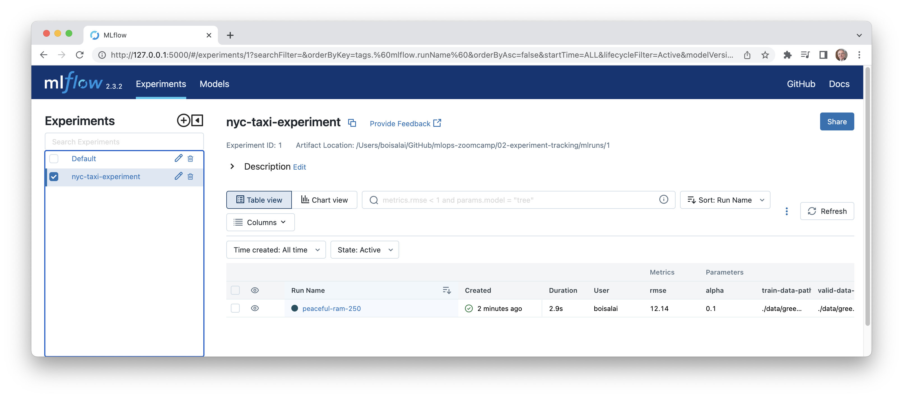

If you click on the **Run Name** (here `peaceful-ram-250`), you should see something like this

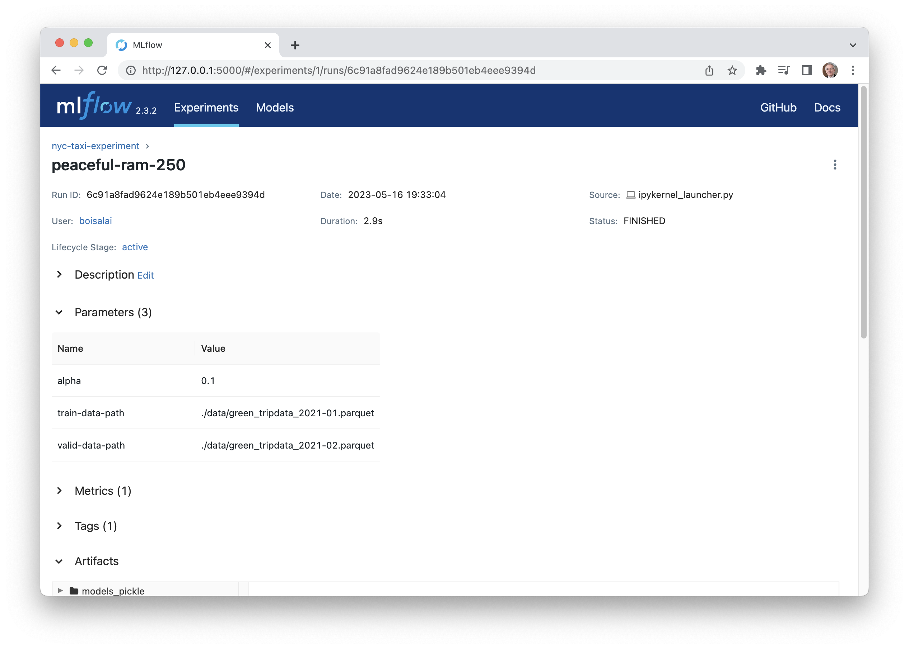

### Additional Materials

#### See also

* [MLflow Documentation](https://mlflow.org/docs/latest/index.html)
* [MLflow Tracking: An efficient way of tracking modeling experiments](https://www.statcan.gc.ca/en/data-science/network/mlflow-tracking)
* [Getting Started with MLFlow](https://bytepawn.com/getting-started-with-mlflow.html)
* [MLflow: An Open Platform to Simplify the Machine Learning Lifecycle](https://www.youtube.com/watch?v=859OxXrt_TI)
* [MLflow guide](https://docs.databricks.com/mlflow/index.html) from Databricks

## 2.3 Experiment tracking with MLflow

:movie_camera: [Youtube](https://www.youtube.com/watch?v=iaJz-T7VWec&list=PL3MmuxUbc_hIUISrluw_A7wDSmfOhErJK&index=13).

### Recap of MLflow example on the previous video

> [00:44](https://www.youtube.com/watch?v=iaJz-T7VWec&list=PL3MmuxUbc_hIUISrluw_A7wDSmfOhErJK&index=13&t=44s) Recap of MLflow example on the previous video

Run again the previous code but with `alpha = 0.01`.

We can compare these two runs (with `alpha = 0.1` and with `alpha = 0.01`). Select theses two runs et click on **Compare** button.

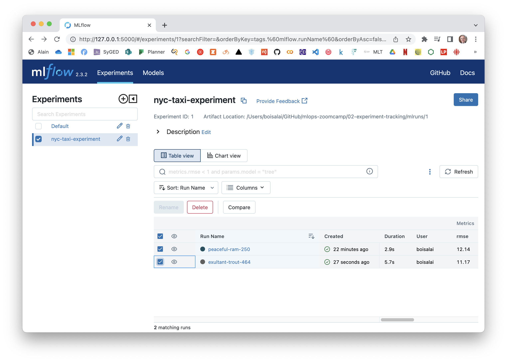

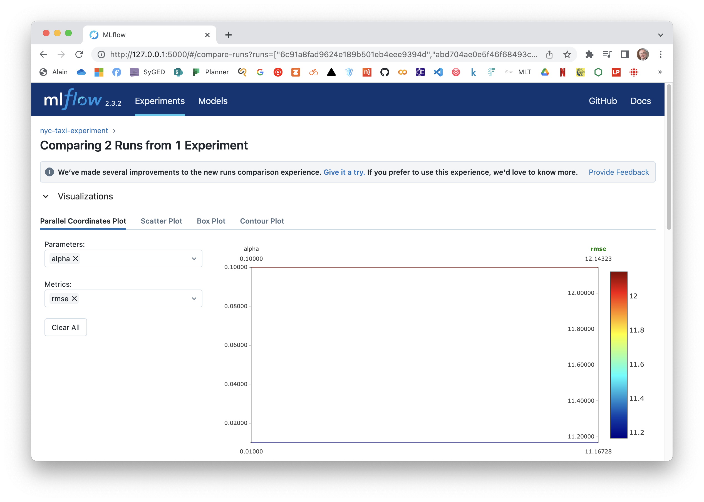

Unfortunately, the graphics aren't very helpful. Let's start again with another model, like XGBoost.

### Adding hyperparameter tuning into notebook using hyperopt

> [01:14](https://www.youtube.com/watch?v=iaJz-T7VWec&list=PL3MmuxUbc_hIUISrluw_A7wDSmfOhErJK&index=13&t=74s) Adding hyperparameter tuning into notebook using hyperopt

Run the following.

```python
import xgboost as xgb

from hyperopt import fmin, tpe, hp, STATUS_OK, Trials
from hyperopt.pyll import scope
```

[Hyperopt](https://github.com/hyperopt/hyperopt) is an open source [hyperparameter](https://en.wikipedia.org/wiki/Hyperparameter_optimization) 
tuning library that uses a Bayesian approach to find the best values for the hyperparameters.

See [Tutorial on hyperopt](https://www.kaggle.com/code/fanvacoolt/tutorial-on-hyperopt) on Kaggle for more.

The way to use hyperopt is to describe:

* the objective function to minimize
* the space over which to search
* the database in which to store all the point evaluations of the search
* the search algorithm to use

To use Hyperopt, we need to specify four key elements for our model:

* **Objective function**: This should return the value we want to minimize during the calculation. In our case, it is the "accuracy_score" function.
* **Research space**: This defines the range of values that a given hyperparameter can take.
* **Tuning algorithm**: In Hyperopt, there are two main hyperparameter search algorithms: Random Search and Tree of Parzen Estimators (Bayesian). 
* **Ratings**:  This is the number of different hyperparameter instances on which to train the model.

In the section below, we will show an example of how to implement the above steps.

### Defining objective function

> [03:18](https://www.youtube.com/watch?v=iaJz-T7VWec&list=PL3MmuxUbc_hIUISrluw_A7wDSmfOhErJK&index=13&t=198s) Defining objective function

The first thing that we need to define is the objective function.

```python
def objective(params):
    with mlflow.start_run():
        mlflow.set_tag("model", "xgboost")
        mlflow.log_params(params)
        booster = xgb.train(
            params=params,
            dtrain=train,
            num_boost_round=1000,
            evals=[(valid, 'validation')],
            early_stopping_rounds=50
        )
        y_pred = booster.predict(valid)
        rmse = mean_squared_error(y_val, y_pred, squared=False)
        mlflow.log_metric("rmse", rmse)

    return {'loss': rmse, 'status': STATUS_OK}
```

The `params` argument contains the set of XGBoost hyperparameters for a specific runtime.
These parameters will be logged in MLflow and will also pass to the XGBoost model
to generate the `booster` object.

We will use the validation set to control the optimization with a maximum of 1000 iterations.
If there are 50 or more iterations without any improvement in the validation error
then XGBoost optimization will stop.

Once the model is trained, we will make predictions on the validation set to calculate the root mean square error (RMSE).
The RMSE is also saved in MLflow.

Then we return the loss value (RMSE) and a correct status which is just a signal for Hyperopt to know that the optimization was successful.

See [Defining a Function to Minimize](http://hyperopt.github.io/hyperopt/getting-started/minimizing_functions/) for more information.

### Defining search space

> [04:43](https://www.youtube.com/watch?v=iaJz-T7VWec&list=PL3MmuxUbc_hIUISrluw_A7wDSmfOhErJK&index=13&t=283s) Defining search space

Next, we need to define the search space.

In the example below, `max_depth` control the depth of the trees from 4 to 100 levels.

```python
search_space = {
    'max_depth': scope.int(hp.quniform('max_depth', 4, 100, 1)),
    'learning_rate': hp.loguniform('learning_rate', -3, 0),  # [exp(-3);exp(0)] = [0.05;1]
    'reg_alpha': hp.loguniform('reg_alpha', -5, -1),
    'reg_lambda': hp.loguniform('reg_lambda', -6, -1),
    'min_child_weight': hp.loguniform('min_child_weight', -1, 3),
    'objective': 'reg:linear',
    'seed': 42
}
```

See [Defining a Search Space](http://hyperopt.github.io/hyperopt/getting-started/search_spaces/) for more information.

### Passing information to fmin optimization method

> [07:37](https://www.youtube.com/watch?v=iaJz-T7VWec&list=PL3MmuxUbc_hIUISrluw_A7wDSmfOhErJK&index=13&t=457s) Passing information to fmin optimization method

After, we need to pass the objective function, search space and the tuning algorithm that we are going to use to the optimization method - `fmin`.
The number of iterations is set to 50.

We also need to pass this information to a `Trials` object in order to store the information.

```python
best_result = fmin(
    fn=objective,
    space=search_space,
    algo=tpe.suggest,
    max_evals=50,
    trials=Trials()
)
```

Finally, because we use XGBoost, we need to pass specific data type for the training.

```python
train = xgb.DMatrix(X_train, label=y_train)
valid = xgb.DMatrix(X_val, label=y_val)
```

### Running experiment

> [09:05](https://www.youtube.com/watch?v=iaJz-T7VWec&list=PL3MmuxUbc_hIUISrluw_A7wDSmfOhErJK&index=13&t=545s) Running experiment

Run all code above. We can see XGBoost started optimizing the validation RMSE. 

If we go to MLflow UI, we will find there are new runs.
For each run, we can see the details of the optimization.

<table>
  <tr>
    <td>
      
    </td>
    <td>
      
    </td>
  </tr>
</table>

This optimization can take time, almost 25 minutes on a MacBook Pro M1.

### Exploring experiment results

> [10:48](https://www.youtube.com/watch?v=iaJz-T7VWec&list=PL3MmuxUbc_hIUISrluw_A7wDSmfOhErJK&index=13&t=648s) Exploring experiment results

Once the optimization is complete, we can explore the results.

In MLflow UI, select **Experiments**, select **myc-taxi-experiment**, enter `tags.model = 'xgboost'` to the search field. 
We should see all the results we got with this tag.

Select all of them and click on **Compare** button.

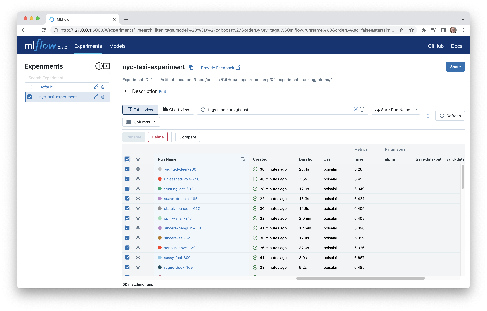

### Comparing results with parallel coordinates plot

> [11:24](https://www.youtube.com/watch?v=iaJz-T7VWec&list=PL3MmuxUbc_hIUISrluw_A7wDSmfOhErJK&index=13&t=684s) Comparing results with parallel coordinates plot

The first visualization that you should see is a parallel coordinates plot where you can see 2-5 different dimensions that can help you compare the runs in details.


Hyperparameter optimization algorithm has tried many different values of hyperparameters so we have more values to compare.
From the plot, you can see that the RMSE varies from 6.3 to 6.68. 

If we click on the right edge of this chart, we can easily spot that actually lower values of RMSE are obtained with 
lower value of `min_child_weight`. The correlation with `max_depth` if not that clear. We can have `max_depth=6` to `max_depth=80` with a low value of RSME.
In the case of learning rate, the chart indicates that we may want to continue exploring lower values of this hyperparameter.

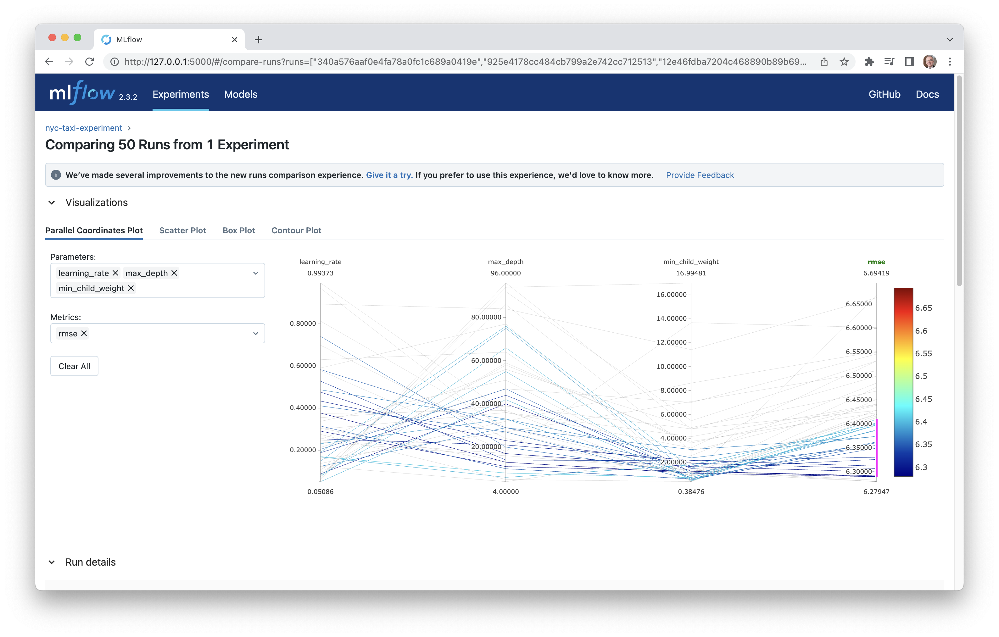

### Comparing results with scatter plot

> [13:12](https://www.youtube.com/watch?v=iaJz-T7VWec&list=PL3MmuxUbc_hIUISrluw_A7wDSmfOhErJK&index=13&t=792s) Comparing results with scatter plot

The scatter plot on the bottom right shows the correlation between parameters.
The examples below show the correlations between RMSE and the learning rate and the `min_child_weight`.

<table>
  <tr>
    <td>
      
    </td>
    <td>
      
    </td>
  </tr>
</table>

### Comparing results with contour plot

> [14:19](https://www.youtube.com/watch?v=iaJz-T7VWec&list=PL3MmuxUbc_hIUISrluw_A7wDSmfOhErJK&index=13&t=859s) Comparing results with contour plot

The contour plot shows the relationships between two hyperparameters and RMSE.
We can see it is hard to see what values of `max_depth` and `learning_rate` are good at first sight.
The use of the contour plot can help in finding some good starting values of parameters.

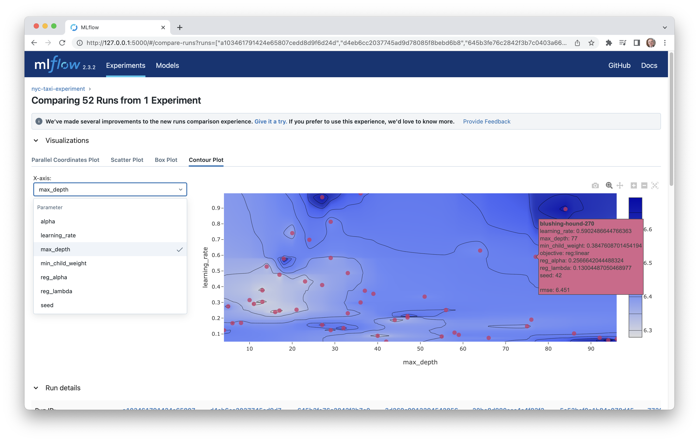

### Selecting the best model

> [15:32](https://www.youtube.com/watch?v=iaJz-T7VWec&list=PL3MmuxUbc_hIUISrluw_A7wDSmfOhErJK&index=13&t=932s) Selecting the best model

To select the best combinaison of hyperparameters is to click on **Experiments** tab, filter for `tags.model = 'xgboost'`, sort the `rmse` columns
and select the first run.

On my experiments, I have for `rmse=6.279` the following hyoperparameters:

* `learning_rate`: 0.24844120916314852
* `max_depth`: 17
* `min_child_weight`: 1.3692489683417093
* `objective`: `reg:linear`
* `reg_alpha`: 0.34964667744899475
* `reg_lambda`: 0.24520589994202519

### Training a new model with obtained parameter

> [17:03](https://www.youtube.com/watch?v=iaJz-T7VWec&list=PL3MmuxUbc_hIUISrluw_A7wDSmfOhErJK&index=13&t=1023s) Training a new model with obtained parameter

Now, we want to train the model using the parameters that we obtained, save the model and log the results into MLflow.

We use `mlflow.xgboost.autolog()` to automaticaly logs the default parameters, metrics and model.

See [Automatic Logging](https://mlflow.org/docs/latest/tracking.html#automatic-logging) for more inforaation.

Use the Python context manager `with` statement to start the experiment un by calling `mlflow.start_run`.

```python
# mlflow.xgboost.autolog(disable=True)

with mlflow.start_run():
    train = xgb.DMatrix(X_train, label=y_train)
    valid = xgb.DMatrix(X_val, label=y_val)

    best_params = {
        'learning_rate': 0.24844120916314852,
        'max_depth': 17,
        'min_child_weight': 1.3692489683417093,
        'objective': 'reg:linear',
        'reg_alpha': 0.34964667744899475,
        'reg_lambda': 0.24520589994202519,
        'seed': 42
    }

    mlflow.xgboost.autolog()
    # mlflow.log_params(best_params)

    booster = xgb.train(
        params=best_params,
        dtrain=train,
        num_boost_round=1000,
        evals=[(valid, 'validation')],
        early_stopping_rounds=50
    )
```

### Observing new model's results

> [21:24](https://www.youtube.com/watch?v=iaJz-T7VWec&list=PL3MmuxUbc_hIUISrluw_A7wDSmfOhErJK&index=13&t=1284s) Observing new model's results

Run the code above using the following command.

```bash
python xyz.py
```

We should see this in the MLflow UI.

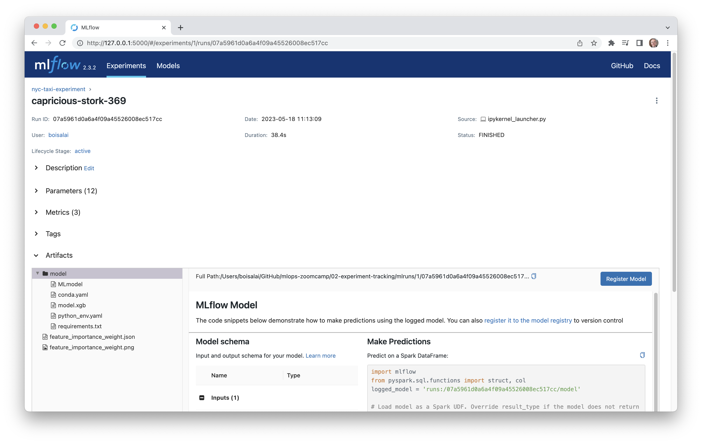

We obtained a more complete set of hypermarameters. 
We have three different metrics (`best_iteration=978`, `stopped_iteration=999`, `validation-rmse=6.279`).
We see under **Artifacts** tab the saved model as an MLflow model.

## 2.4 Model management

:movie_camera: [Youtube](https://www.youtube.com/watch?v=OVUPIX88q88&list=PL3MmuxUbc_hIUISrluw_A7wDSmfOhErJK&index=14).

### Introduction of machine learning lifecycle

> [00:04](https://www.youtube.com/watch?v=OVUPIX88q88&list=PL3MmuxUbc_hIUISrluw_A7wDSmfOhErJK&index=14&t=4s) Introduction of machine learning lifecycle

Experiment tracking (also referred to as experiment management) is a part of MLOps: a larger ecosystem of tools and methodologies that 
deals with the operationalization of machine learning.

MLOps deals with every part of ML project lifecycle from developing models by scheduling distributed training jobs, managing model serving, 
monitoring the quality of models in production, and re-training those models when needed. 


See [ML Experiment Tracking: What It Is, Why It Matters, and How to Implement It](https://neptune.ai/blog/ml-experiment-tracking) 
from [neptune.ai](https://neptune.ai/) for more.

### Model management

> [01:37](https://www.youtube.com/watch?v=OVUPIX88q88&list=PL3MmuxUbc_hIUISrluw_A7wDSmfOhErJK&index=14&t=97s) Model management

What's wrong with this? [...without MLOps tool like MLflow]

* Error prone
* No versioning
* No model lineage. Model lineage refers to understanding and tracking all of the inputs that were used to create a specific version of a model.

### Model management in MLflow

> [02:49](https://www.youtube.com/watch?v=OVUPIX88q88&list=PL3MmuxUbc_hIUISrluw_A7wDSmfOhErJK&index=14&t=169s) Model management in MLflow

In this video, we explained how to save the model with [`mlflow.log_artifact()`](https://mlflow.org/docs/latest/python_api/mlflow.html#mlflow.log_artifact).

```python
y_pred = booster.predict(valid)
rmse = mean_squared_error(y_val, y_pred, squared=False)
mlflow.log_metric("rmse", rmse)

# With models/lin_reg.bin under artifact_uri/models_pickle directory.
mlflow.log_artifact(local_path="models/lin_reg.bin", artifact_path="models_pickle")
```

We can thus download the model and run it later to make some predictions.

### Logging models in MLflow

> [05:09](https://www.youtube.com/watch?v=OVUPIX88q88&list=PL3MmuxUbc_hIUISrluw_A7wDSmfOhErJK&index=14&t=309s) Logging models in MLflow

Below is a second way to log a model with XGBoost autologging disabled.

```python
mlflow.xgboost.autolog(disable=True)

with mlflow.start_run():
    train = xgb.DMatrix(X_train, label=y_train)
    valid = xgb.DMatrix(X_val, label=y_val)

    best_params = {
        'learning_rate': 0.24844120916314852,
        'max_depth': 17,
        'min_child_weight': 1.3692489683417093,
        'objective': 'reg:linear',
        'reg_alpha': 0.34964667744899475,
        'reg_lambda': 0.24520589994202519,
        'seed': 42
    }

    # mlflow.xgboost.autolog()
    mlflow.log_params(best_params)

    booster = xgb.train(
        params=best_params,
        dtrain=train,
        num_boost_round=1000,
        evals=[(valid, 'validation')],
        early_stopping_rounds=50
    )

    y_pred = booster.predict(valid)
    rmse = mean_squared_error(y_val, y_pred, squared=False)
    mlflow.log_metric("rmse", rmse)

    mlflow.xgboost.log_model(booster, artifact_path="models_mlflow")
```

We should see this in the MLflow UI.

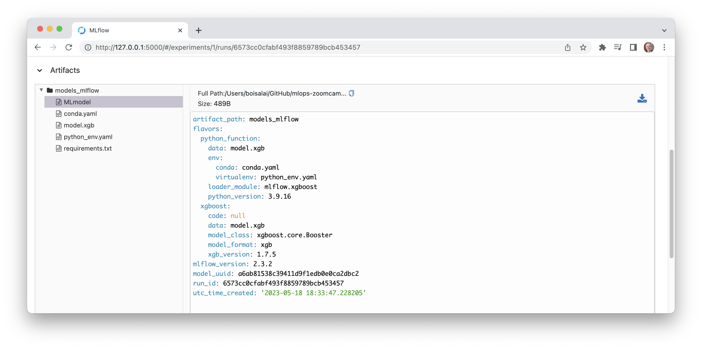

To log the preprocessor, just to this.

```python
y_pred = booster.predict(valid)
    rmse = mean_squared_error(y_val, y_pred, squared=False)
    mlflow.log_metric("rmse", rmse)

with open("models/preprocessor.b", "wb") as f_out:
    pickle.dump(dv, f_out)

mlflow.log_artifact("models/preprocessor.b", artifact_path="preprocessor")

mlflow.xgboost.log_model(booster, artifact_path="models_mlflow")
```

You should see this in the MLflow UI with the preprocessor saved.


If you click on **models_mlflow**, you should also see code snippets that demonstrate how to make predictions using the logged model with Spark and Pandas.

### Making predictions using information from MLflow artifact

> [12:03](https://www.youtube.com/watch?v=OVUPIX88q88&list=PL3MmuxUbc_hIUISrluw_A7wDSmfOhErJK&index=14&t=723s) Making predictions using information from MLflow artifact

The following code load model as a PyFuncModel.

```python
import mlflow
logged_model = 'runs:/4b4e1c902fc34082b26646a313a6d851/models_mlflow'

# Load model as a PyFuncModel.
loaded_model = mlflow.pyfunc.load_model(logged_model)
loaded_model
# mlflow.pyfunc.loaded_model:
#   artifact_path: models_mlflow
#   flavor: mlflow.xgboost
#   run_id: 4b4e1c902fc34082b26646a313a6d851
```

Instead of this, we could load the model as a XGBoost object.

```python
xgboost_model = mlflow.xgboost.load_model(logged_model)
xgboost_model
# <xgboost.core.Booster at 0x2bf6afe20>

y_pred = xgboost_model.predict(valid)
y_pred[:10]
# array([15.012922,  7.269517, 13.304856, 24.477734,  9.294867, 17.213734,
#        10.961633,  8.156836,  9.016175, 19.806286], dtype=float32)
```

### Recap

> [14:09](https://www.youtube.com/watch?v=OVUPIX88q88&list=PL3MmuxUbc_hIUISrluw_A7wDSmfOhErJK&index=14&t=849s) Recap

Two options to log models in MLflow.

* Log model as an artifact: `mlflow.log.artifact("my_model", artifact_path="models")`
* Log model using the method `log_model`: `mlflow.<framework>.log_model(model, artifact_path="models")`

The second options store more information about the model which then allowed us to load it very easily.

MLFlow can load model from many frameworks (e.g. PyTorch, Keras, XGBoost...).
We can access this model using different flavors (as a Python function or by the underlying framework).
We can later deploy this model as a Python function, or in a Docker container, in jJpyter notebook, or maybe as a batch job in Spark.

## 2.5 Model registry

:movie_camera: [Youtube](https://www.youtube.com/watch?v=TKHU7HAvGH8&list=PL3MmuxUbc_hIUISrluw_A7wDSmfOhErJK&index=15).

### Motivation

> [00:06](https://www.youtube.com/watch?v=TKHU7HAvGH8&list=PL3MmuxUbc_hIUISrluw_A7wDSmfOhErJK&index=15&t=6s) Motivation

Suppose a data scientist working with you has implemented a machine learning model.
After some time, he came up with a new version of the model. He is satisfied with the performance of this new model.
It sends you an email asking to deploy this model in production.

You are basically a deployment engineer (ML or MLOps engineer) and you start thinking about how to deploy it.

* How were you able to put this into production?
* What has changed between the previous version of the template and the new one?
* Do I need to update the hyperparameters of the model in production?
* Is pre-processing required to run this model?
* What environment should this model work in?
* What are the dependencies and version of these libraries?

All these questions are not included in this email and you can start playing back again and vice versa with
data scientists on how to get all this information.

It's not very efficient.

The solution is to have a model registry in which to store all this information to make this process much easier.

### Model registry

> [02:09](https://www.youtube.com/watch?v=TKHU7HAvGH8&list=PL3MmuxUbc_hIUISrluw_A7wDSmfOhErJK&index=15&t=129s) Model registry

The [MLflow Model Registry](https://mlflow.org/docs/latest/model-registry.html) component is a centralized model store, set of APIs, and UI, 
to collaboratively manage the full lifecycle of an MLflow Model. It provides model lineage (which MLflow experiment and run produced the model), 
model versioning, stage transitions (for example from staging to production), and annotations.

In the previous section, we saw how to log hyperparameters, metrics, artifacts, etc.

We need a tracking server running locally to track all of these information.

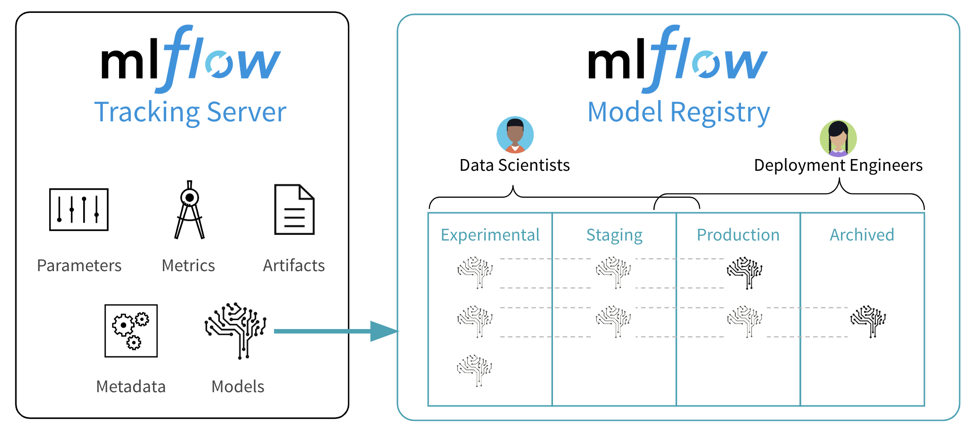

MLFlow Tracking is a simple client/server solution to log, track and share model metrics at scale. Using MLFlow makes sense both during the 
development of the model and also once the model is running in production.

A centralized registry for models across an organization affords data teams the ability to:

* discover registered models, current stage in model development, experiment runs, and associated code with a registered model
* transition models to deployment stages
* deploy different versions of a registered model in different stages, offering MLOps engineers ability to deploy and conduct testing of different model versions
* archive older models for posterity and provenance
* peruse model activities and annotations throughout model's lifecycle
* control granular access and permission for model registrations, transitions or modifications

### Model analysis

> [04:34](https://www.youtube.com/watch?v=TKHU7HAvGH8&list=PL3MmuxUbc_hIUISrluw_A7wDSmfOhErJK&index=15&t=274s) Model analysis

The instructor compares certain information (duration, rmse, size) between models (XGBoost, sklearn LinearSVR, ExtraTrees, RandomForest), 
and decides which one to register.

Now we want to identify which are the models that are ready to be deployed in production.

### Accessing models in the model registry

> [06:24](https://www.youtube.com/watch?v=TKHU7HAvGH8&list=PL3MmuxUbc_hIUISrluw

For each run, we can see in the MLflow UI the duration of the run, the RMSE, and the size of the model.
Based on this information, we decide to promote a model in production and another model to staging.

### Promoting selected model to model registry

> [07:50](https://www.youtube.com/watch?v=TKHU7HAvGH8&list=PL3MmuxUbc_hIUISrluw_A7wDSmfOhErJK&index=15&t=470s) Promoting selected model to model registry

To promote a existing model to the model registry, we just need to select **Artifacts**, click on **models_mlflow**, and click on **Register Model** button.

We need to select the model or create a new one. The instructor gives the model name `nyc-taxi-regressor`.

After registring models, select the **Models** tab to show the list of registred models. For now, we have only one `nyc-taxi-regressor`.
Select this one. You should see something like this.

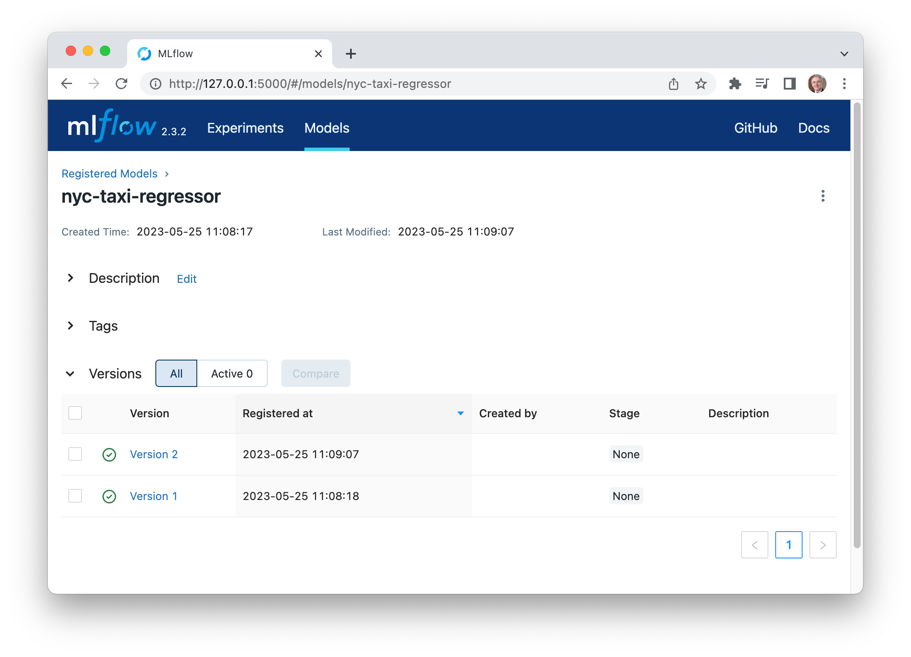

You can enter a description (e.g. "The NYC Taxi Predictor for Trip Duration"). You can also add some tags. We have also 
a list of all avalaible version of this model.

If you select a version, we see no information about which model is but you can on the **Source Run** to see the detail of the model.

<table>
  <tr>
    <td>
      
    </td>
    <td>
      
    </td>
  </tr>
</table>

### Assigning registered model to different stages

> [11:25](https://www.youtube.com/watch?v=TKHU7HAvGH8&list=PL3MmuxUbc_hIUISrluw_A7wDSmfOhErJK&index=15&t=685s) Assigning registered model to different stages

The MLflow Model Registry defines several model stages: **None**, **Staging**, **Production**, and **Archived**. 
Each stage has a unique meaning. For example, **Staging** is meant for model testing, while **Production** is for models that have completed 
the testing or review processes and have been deployed to applications.

For example, we can assign the version 1 to production stage.

<table>
  <tr>
    <td>
      
    </td>
    <td>
      
    </td>
  </tr>
</table>

See [Transition a model version](https://docs.databricks.com/mlflow/model-registry-example.html#transition-a-model-version) for more.

### Demonstration with jupyter notebook

> [12:41](https://www.youtube.com/watch?v=TKHU7HAvGH8&list=PL3MmuxUbc_hIUISrluw_A7wDSmfOhErJK&index=15&t=761s) Demonstration with jupyter notebook

We can also manage experiments and registred models directly with python.

See [model-registry.ipynb](https://github.com/DataTalksClub/mlops-zoomcamp/blob/main/02-experiment-tracking/model-registry.ipynb).

```python
from mlflow.tracking import MlflowClient

MLFLOW_TRACKING_URI = "sqlite:///mlflow.db"
```

#### Interacting with the MLflow tracking server

The `MlflowClient` object allows us to interact with...

* an **MLflow Tracking Server** that creates and manages experiments and runs.
* an **MLflow Registry Server** that creates and manages registered models and model versions.

To instantiate it, we need to pass a tracking URI and/or a registry URI

```python
client = MlflowClient(tracking_url=MLFLOW_TRACKING_URI)
```

To show the list of experiments, just do this. 
See [mlflow.search_experiments()](https://mlflow.org/docs/latest/python_api/mlflow.html?highlight=search_experiments#mlflow.search_experiments)


```python
mlflow.search_experiments()

# or...
from mlflow.tracking import MlflowClient

client = MlflowClient()
client.search_experiments()
```

Note that `mlflow.list_experiments()` seems deprecated.

To create an experiment.

```python
client.create_experiment(name="my-cool-experiment")
```

To search experiments.

```python
from mlflow.entities import ViewType

runs = client.search_runs(
    experiment_ids='1',
    filter_string="metrics.rmse < 7",
    run_view_type=ViewType.ACTIVE_ONLY,
    max_results=5,
    order_by=["metrics.rmse ASC"]
)

for run in runs:
    print(f"run id: {run.info.run_id}, rmse: {run.data.metrics['rmse']:.4f}")
```

#### Interacting with the Model Registry

Below, we will use the `MlflowClient` instance to:

* Register a new version for the experiment `nyc-taxi-regressor`
* Retrieve the latests versions of the model `nyc-taxi-regressor` and check that a new version `4` was created.
* Transition the version `4` to "Staging" and adding annotations to it.

```python
import mlflow

mlflow.set_tracking_uri(MLFLOW_TRACKING_URI)
```

To registrer a new version for the experiment.

```python
run_id = "b8904012c84343b5bf8ee72aa8f0f402"
model_uri = f"runs:/{run_id}/model"
mlflow.register_model(model_uri=model_uri, name="nyc-taxi-regressor")
```

To get the latest versions of a model.

```python
model_name = "nyc-taxi-regressor"
latest_versions = client.get_latest_versions(name=model_name)

for version in latest_versions:
    print(f"version: {version.version}, stage: {version.current_stage}")
```

To transition a model.

```python
model_version = 4
new_stage = "Staging"
client.transition_model_version_stage(
    name=model_name,
    version=model_version,
    stage=new_stage,
    archive_existing_versions=False
)
```

To update a model description.

```python
from datetime import datetime

date = datetime.today().date()

client.update_model_version(
  name=model_name,
  version=model_version,
  description=f"The model version {model_version} was transitioned to {new_stage} on {date}"
)
```

#### Comparing versions and selecting the new "Production" model

In the last section, we will retrieve models registered in the model registry and compare their performance on an unseen test set.
The idea is to simulate the scenario in which a deployment engineer has to interact with the model registry to decide whether to update the 
model version that is in production or not.

These are the steps:

1. Load the test dataset, which corresponds to the NYC Green Taxi data from the month of March 2021.
2. Download the `DictVectorizer` that was fitted using the training data and saved to MLflow as an artifact, and load it with pickle.
3. Preprocess the test set using the `DictVectorizer` so we can properly feed the regressors.
4. Make predictions on the test set using the model versions that are currently in the "Staging" and "Production" stages, and compare their performance.
5. Based on the results, update the "Production" model version accordingly.

**Note**: the model registry doesn't actually deploy the model to production when you transition a model to the "Production" 
stage, it just assign a label to that model version. You should complement the registry with some CI/CD code that does the actual 
deployment.

Below, the code to load a dataframe, preprocessus that dataset and test the model on that dataset.

```python
from sklearn.metrics import mean_squared_error
import pandas as pd

# Read the dataframe.
def read_dataframe(filename):
    df = pd.read_csv(filename)

    df.lpep_dropoff_datetime = pd.to_datetime(df.lpep_dropoff_datetime)
    df.lpep_pickup_datetime = pd.to_datetime(df.lpep_pickup_datetime)

    df['duration'] = df.lpep_dropoff_datetime - df.lpep_pickup_datetime
    df.duration = df.duration.apply(lambda td: td.total_seconds() / 60)

    df = df[(df.duration >= 1) & (df.duration <= 60)]

    categorical = ['PULocationID', 'DOLocationID']
    df[categorical] = df[categorical].astype(str)
    
    return df

# Process the dataset using the vectorizer preprocessor.
def preprocess(df, dv):
    df['PU_DO'] = df['PULocationID'] + '_' + df['DOLocationID']
    categorical = ['PU_DO']
    numerical = ['trip_distance']
    train_dicts = df[categorical + numerical].to_dict(orient='records')
    # Return the transformed data using the fitted preprocessor.
    return dv.transform(train_dicts)

# Test the model.
def test_model(name, stage, X_test, y_test):
    model = mlflow.pyfunc.load_model(f"models:/{name}/{stage}")
    y_pred = model.predict(X_test)
    return {"rmse": mean_squared_error(y_test, y_pred, squared=False)}
```

We can use:

* `green_tripdata_2021-01.csv` for training
* `green_tripdata_2021-02.csv` for validation
* `green_tripdata_2021-03.csv` for test

Below, an example that use the code above to load a preprocessor, call it to obtain the training data, and test the model.

```python
# Read the dataframe.
df = read_dataframe("data/green_tripdata_2021-03.csv")

# Download the preprocessor.
client.download_artifacts(run_id=run_id, path='preprocessor', dst_path='.')

import pickle

# Load the preprocessor with pickle.
with open("preprocessor/preprocessor.b", "rb") as f_in:
    dv = pickle.load(f_in)

# Call the preprocess method.
X_test = preprocess(df, dv)

# Test the model in production and the model in staging.
target = "duration"
y_test = df[target].values
 
%time test_model(name=model_name, stage="Production", X_test=X_test, y_test=y_test)
# CPU times: user 139 ms, sys: 44.6 ms, total: 183 ms
# Wall time: 447 ms
# {'rmse': 6.659623830022514}

%time test_model(name=model_name, stage="Staging", X_test=X_test, y_test=y_test)
# CPU times: user 6.94 s, sys: 216 ms, total: 7.16 s
# Wall time: 7.28 s
# {'rmse': 6.881555517147188}

# Run this if we want to promote the staging model to production.
client.transition_model_version_stage(
    name=model_name,
    version=4,
    stage="Production",
    archive_existing_versions=True
)
```

### Recap

> [32:15](https://www.youtube.com/watch?v=TKHU7HAvGH8&list=PL3MmuxUbc_hIUISrluw_A7wDSmfOhErJK&index=15&t=1935s) Recap

### Additional Materials

* [Introducing the MLflow Model Registry](https://www.databricks.com/blog/2019/10/17/introducing-the-mlflow-model-registry.html) from Databricks.
* [MLflow Model Registry example](https://docs.databricks.com/mlflow/model-registry-example.html) from Databricks.

## 2.6 MLflow in practice

:movie_camera: [Youtube](https://www.youtube.com/watch?v=1ykg4YmbFVA&list=PL3MmuxUbc_hIUISrluw_A7wDSmfOhErJK&index=15).

Let's consider these three scenarios:

* A single data scientist participating in an ML competition
* A cross-functional team with one data scientist working on an ML model
* Multiple data scientists working on multiple ML models

These three scenarios has different requirements.

* For the first scenario, the single data scientist doesn't need to keep track of the runs remotely on a tracking server. Saving this information locally will be enough.
Using the model registry is also useless because the data scientist is not interested in deploying this model to production. 
* On the second scenario, the cross-functional team has the requirement of sharing the experiment information but not necessarily running tracking server remotely.
Running a tracking server locally on the data scientist computer could be enough. Using the model registry would be a good idea to manage the life cycle of the models
but is not clear if we need to run it remotely or on the local host.
* On the third scenario, sharing the information is very important. The data scientist are collaborating to build the models. One data scientist could lunch an experiment add some 
brands, and then another data scientist can continue exploring hyperparameters and different models to add even more runs to these experiments. For this scenario, we
need to run a remote tracking server and a remote model registry server.

To set up a MLflow environment, we need to think about three main aspects.

* Backend store (where MLflow will save all the metadata (metrics, parameters, tags...) about your experiments)
  * Local filesystem (in a folder in our computer)
  * SQLAlchemy compatible DB (e.g. SQLite)
* Artifacts store
  * Local filesystem
  * Remote (e.g. S3 bucket)
* Tracking server
  * No tracking server 
  * Localhost
  * Remote

### Scenario 1: A single data scientist participating in an ML competition

> [00:00](https://www.youtube.com/watch?v=1ykg4YmbFVA&list=PL3MmuxUbc_hIUISrluw_A7wDSmfOhErJK&index=14&t=255s) Scenario 1

See [scenario-1.ipynb](https://github.com/DataTalksClub/mlops-zoomcamp/blob/main/02-experiment-tracking/running-mlflow-examples/scenario-1.ipynb)

MLflow setup:

* Tracking server: no
* Backend store: local filesystem
* Artifacts store: local filesystem

The experiments can be explored locally by launching the MLflow UI.

By default, the MLflow Python API logs runs locally to files in an `mlruns` directory wherever you ran your program.
See [Where Runs Are Recorded](https://mlflow.org/docs/latest/tracking.html#where-runs-are-recorded).

```python
import mlflow

print(mlflow.__version__)
# 2.3.2

print(f"tracking URI: '{mlflow.get_tracking_uri()}'")
# tracking URI: 'file:///Users/.../mlops-zoomcamp/02-experiment-tracking/running-mlflow-examples/mlruns'

mlflow.search_experiments()
# <Experiment: artifact_location='file:///Users/.../mlops-zoomcamp/02-experiment-tracking/running-mlflow-examples/mlruns/0', 
# creation_time=1685034098307, experiment_id='0', last_update_time=1685034098307, lifecycle_stage='active', name='Default', tags={}>]
```

Note that `mlflow.list_experiments()` seems deprecated.

The first time we run `mlflow.search_experiments()`, the folder `/mlruns` is created.

In the `/mlruns/0` folder, we see a `meta.yaml` file with this information.

```yaml
artifact_location: file:///Users/.../mlops-zoomcamp/02-experiment-tracking/running-mlflow-examples/mlruns/0
creation_time: 1685034098307
experiment_id: '0'
last_update_time: 1685034098307
lifecycle_stage: active
name: Default
```

Creating an experiment and logging a new run.

```python
from sklearn.linear_model import LogisticRegression
from sklearn.datasets import load_iris
from sklearn.metrics import accuracy_score

mlflow.set_experiment("my-experiment-1")

with mlflow.start_run():
    X, y = load_iris(return_X_y=True)

    params = {"C": 0.1, "random_state": 42}
    mlflow.log_params(params)

    lr = LogisticRegression(**params).fit(X, y)
    y_pred = lr.predict(X)
    mlflow.log_metric("accuracy", accuracy_score(y, y_pred))

    mlflow.sklearn.log_model(lr, artifact_path="models")
    print(f"default artifacts URI: '{mlflow.get_artifact_uri()}'")
```

We have now two experiments

```python
mlflow.search_experiments()
# [<Experiment: artifact_location='file:///Users/.../mlops-zoomcamp/02-experiment-tracking/running-mlflow-examples/mlruns/226472356216602081', 
# creation_time=1685034966153, experiment_id='226472356216602081', last_update_time=1685034966153, lifecycle_stage='active', name='my-experiment-1', tags={}>,
# <Experiment: artifact_location='file:///Users/.../mlops-zoomcamp/02-experiment-tracking/running-mlflow-examples/mlruns/0', 
# creation_time=1685034098307, experiment_id='0', last_update_time=1685034098307, lifecycle_stage='active', name='Default', tags={}>]
```

Note that `mlflow.list_experiments()` seems deprecated.

You should see that other folders under `/mlruns` have been created. 
A directory for the experiment and a subdirectory for each run.

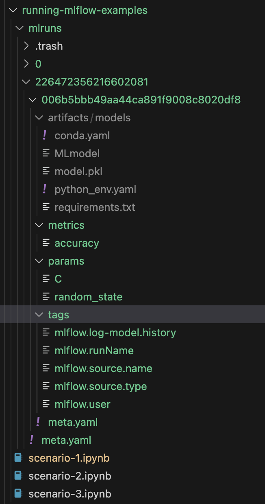

Interacting with the model registry.

```python
from mlflow.tracking import MlflowClient

client = MlflowClient()

from mlflow.exceptions import MlflowException

try:
    client.search_registered_models()
except MlflowException:
    print("It's not possible to access the model registry :(")
```

Note that `client.list_registered_models()` seems deprecated.

You can see what happened in the MLflow UI.
Make sure you are in the correct folder when you start `mlflow ui`.

```bash
cd mlops-zoomcamp
cd 02-experiment-tracking
cd running-mlflow-examples
mlflow ui
```

If you try to access this server http://127.0.0.1:5000, you will get an access denied.
You need to go to settings of your web browser **Privacy and security**, and clear the cookies. 
So clear all the data from the last hour.

You should see the experiment like this.


### Scenario 2: A cross-functional team with one data scientist working on an ML model

> [13:00](https://www.youtube.com/watch?v=1ykg4YmbFVA&list=PL3MmuxUbc_hIUISrluw_A7wDSmfOhErJK&index=14&t=780s) Scenario 2

See [scenario-2.ipynb](https://github.com/DataTalksClub/mlops-zoomcamp/blob/main/02-experiment-tracking/running-mlflow-examples/scenario-2.ipynb)

MLflow setup:

* tracking server: yes, local server
* backend store: sqlite database
* artifacts store: local filesystem

The experiments can be explored locally by accessing the local tracking server.

Before starting scenario 2, destroy the `/mlruns` folders created previously.

To run this example you need to launch the mlflow server locally by running the following command in your terminal:

```bash
mlflow server --backend-store-uri sqlite:///backend.db
```

Run the following.

```python
import mlflow

mlflow.set_tracking_uri("http://127.0.0.1:5000")

print(f"tracking URI: '{mlflow.get_tracking_uri()}'")
# tracking URI: 'http://127.0.0.1:5000'

mlflow.search_experiments()
# [<Experiment: artifact_location='mlflow-artifacts:/0', creation_time=1685037127665, 
# experiment_id='0', last_update_time=1685037127665, lifecycle_stage='active', name='Default', tags={}>]
```

Run an experiment (this is the same code as the one indicated above).

```python
from sklearn.linear_model import LogisticRegression
from sklearn.datasets import load_iris
from sklearn.metrics import accuracy_score

mlflow.set_experiment("my-experiment-1")

with mlflow.start_run():

    X, y = load_iris(return_X_y=True)

    params = {"C": 0.1, "random_state": 42}
    mlflow.log_params(params)

    lr = LogisticRegression(**params).fit(X, y)
    y_pred = lr.predict(X)
    mlflow.log_metric("accuracy", accuracy_score(y, y_pred))

    mlflow.sklearn.log_model(lr, artifact_path="models")
    print(f"default artifacts URI: '{mlflow.get_artifact_uri()}'")
```

We have now two experiments.

```python
mlflow.search_experiments()
# [<Experiment: artifact_location='mlflow-artifacts:/1', creation_time=1685037266082, experiment_id='1', 
# last_update_time=1685037266082, lifecycle_stage='active', name='my-experiment-1', tags={}>,
# <Experiment: artifact_location='mlflow-artifacts:/0', creation_time=1685037127665, experiment_id='0', 
# last_update_time=1685037127665, lifecycle_stage='active', name='Default', tags={}>]
```

We can see there are two new files, actually there is this `backend.db` and there is this `mlartifacts/` to 
store the artifacts for all the runs. 

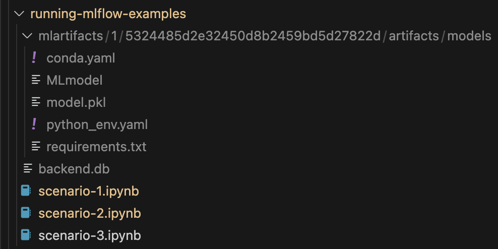

Note that experiment metadata is not stored in the `mlartifacts/` folder but rather in `backend.db`.

Interacting with the model registry.

```python
# Get all the runs for the specified experiment
runs = mlflow.search_runs(experiment_ids='1')
print(runs.T)

# Extract the run_id values from the DataFrame
run_i = runs["run_id"].tolist()[0]
print(f"run_id={run_id}")
```

We should see something like this.

```txt
                                                                               0
run_id                                          5324485d2e32450d8b2459bd5d27822d
experiment_id                                                                  1
status                                                                  FINISHED
artifact_uri                   mlflow-artifacts:/1/5324485d2e32450d8b2459bd5d...
start_time                                      2023-05-25 17:54:26.147000+00:00
end_time                                        2023-05-25 17:54:27.819000+00:00
metrics.accuracy                                                            0.96
params.C                                                                     0.1
params.random_state                                                           42
tags.mlflow.user                                                        boisalai
tags.mlflow.runName                                              bemused-cat-124
tags.mlflow.source.name        /Users/boisalai/miniconda3/envs/exp-tracking-e...
tags.mlflow.log-model.history  [{"run_id": "5324485d2e32450d8b2459bd5d27822d"...
tags.mlflow.source.type                                                    LOCAL
run_ids=5324485d2e32450d8b2459bd5d27822d
```

Finally, registering the model.

```python
mlflow.register_model(
    model_uri=f"runs:/{run_id}/models",
    name='iris-classifier'
)
```

We should get something like this.

```txt
Created version '1' of model 'iris-classifier'.
<ModelVersion: aliases=[], creation_timestamp=1685039668007, current_stage='None', description='', 
last_updated_timestamp=1685039668007, name='iris-classifier', run_id='5324485d2e32450d8b2459bd5d27822d', 
run_link='', source='mlflow-artifacts:/1/5324485d2e32450d8b2459bd5d27822d/artifacts/models', 
status='READY', status_message='', tags={}, user_id='', version='1'>
```

As before you should see this model in MLflow UI.

<table>
  <tr>
    <td>
      
    </td>
    <td>
      
    </td>
  </tr>
</table>

### Scenario 3 - Intro

> [19:25](https://www.youtube.com/watch?v=1ykg4YmbFVA&list=PL3MmuxUbc_hIUISrluw_A7wDSmfOhErJK&index=14&t=1165s) Scenario 3 - Intro

The third scenario is for multiple data scientists working on multiple ML models.

MLflow setup:

* Tracking server: yes, remote server (AWS EC2).
* Backend store: postgresql database.
* Artifacts store: AWS S3 bucket.

The experiments can be explored by accessing the remote server.

The example uses AWS to host a remote server. In order to run the example you'll need an AWS account. 
Follow the steps described in the file [`mlflow_on_aws.md`](https://github.com/DataTalksClub/mlops-zoomcamp/blob/main/02-experiment-tracking/mlflow_on_aws.md) to create a new AWS account and launch the tracking server. See instructions to create a new AWS account in the following sections. 

Before starting scenario 3, delete the `backend.db` file and `/mlartifacts` folder created previously.

### Scenario 3 - AWS Setup

> [23:03](https://www.youtube.com/watch?v=1ykg4YmbFVA&list=PL3MmuxUbc_hIUISrluw_A7wDSmfOhErJK&index=14&t=1383s) Scenario 3 - AWS Setup

First, login to your [AWS Console](https://aws.amazon.com/console/).

Go to EC2 and launch a new instance.
Let's call it `mlflow-tracking-server`. 

Choose an **Amazon Linux 2 AMI (HVM)** with the mention **Free tier eligible**.

Choose also **t2.micro** for instance type with the mention **Free tier eligible**.

Create a new key pair. Give it the name `mlflow-key-pair`. Select **RSA** for Key pair type. 
Select **.pem** for Private key file format.
Click on **Create key pair** button.
Our private key file is downloaded automatically. 

Usually, I move this file (`mlflow-key-pair.pem`) to `~/.ssh` folder.

The reste of configuration can be let with the default.
Click on **Launch instance** button.

You should see something like this.


Select the new `mlflow-key-pair` instance.
Select the **Security** tab.
Click on **Security groups**.
You should see one **Inbound rules**.

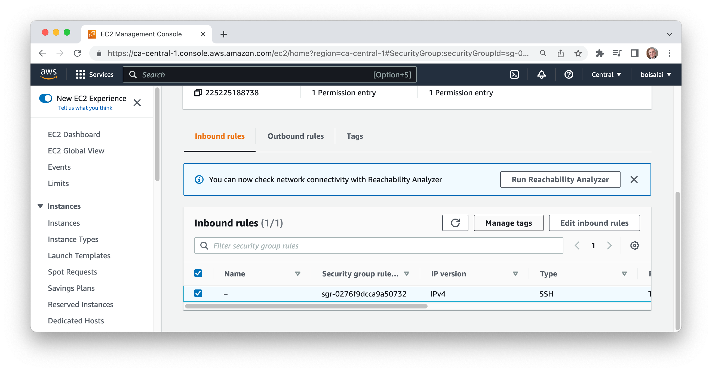

Edit this rule and add a new rule so we can sonnect also through a http connection.
Create a custom TCP in the port 5000 which is where ee are planning to launch the MLflow server.
Also allow access for any IP.

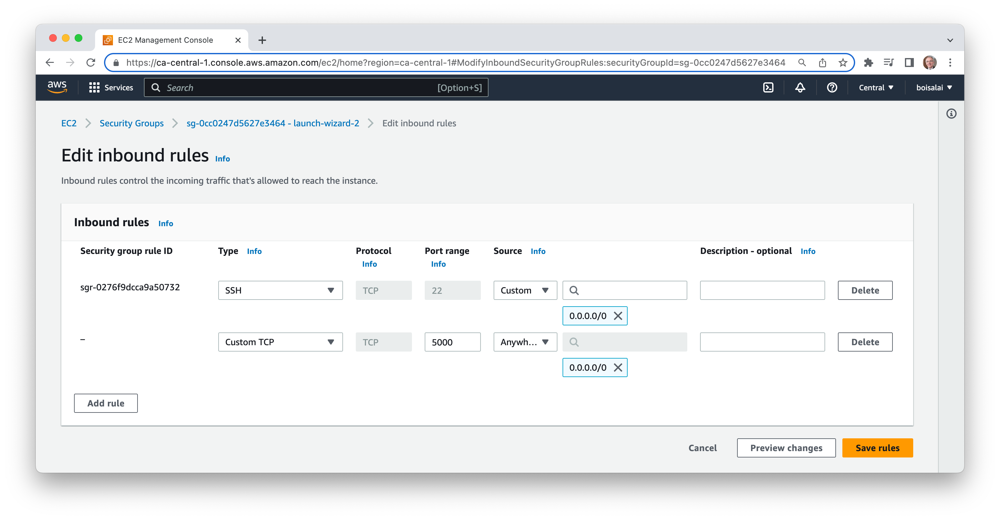

Click on **Save rules**.

Go back to the **EC2 Dashboard** and select **Instances**. We should see that our `mlflow-key-pair` instance is already running.

### Creating an S3 bucket

> [26:04](https://www.youtube.com/watch?v=1ykg4YmbFVA&list=PL3MmuxUbc_hIUISrluw_A7wDSmfOhErJK&index=14&t=1564s) Creating an S3 bucket

The next step will be to create **S3 Bucket** and for that we need to go to **Amazon S3 > Buckets**.
Click on **Create bucket** button.

Give the bucket name `mlflow-artifacts-remote-bird` (the bucket name must be globally unique, that's why i added the suffix `-bird` to the bucket name) 
and click on **Create bucket** button.

You should see something like this.

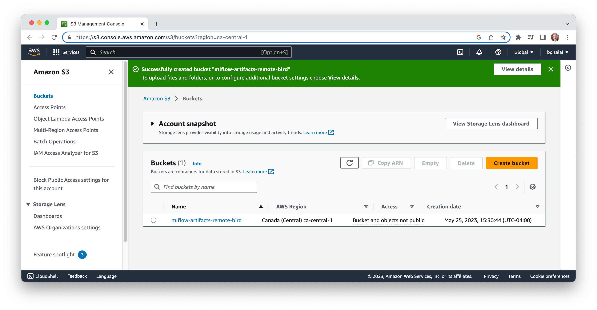

### Creating an RDS instance

> [27:27](https://www.youtube.com/watch?v=1ykg4YmbFVA&list=PL3MmuxUbc_hIUISrluw_A7wDSmfOhErJK&index=14&t=1647s) Creating an RDS instance

The next step is creating the PostgreSQL DB.

For this, go to the **RDS Console** from **AWS Console** and select the **Databases** feature.

Click on **Create database** button.

Configure this new database like this:

* Select **Standard create**, select **PostgreSQL** for Engine options, select **Free tier** for Templates.
* In **Settings** section:
    * Give the name `mlflow-database` to the **DB instance identifier** field.
    * Give the name `mlflow` to the **Master username** field.
    * Select the **Auto generate a password** checkbox.
* In **Instance configuration** section, select **db.t3.micro** under **Instance configuration**.
* In **Connectivity** section:
    * Don't allow public access because we will access it only from our AWS EC2 instance.
    * For now, use the **default VPC security group**.
    * Under **Additional configuration** tab, keep the default **Database port** to **5432** for PostgreSQL.
* In **Additional configuration** section, give the name `mlflow_db` to the **Initial database name** field.

Click on **Create database** button. 

Your database might take a few minutes to launch.
We have generated your database master password during the database creation and it will be displayed in the credential details. 
This is the only time you will be able to view this password. However you can modify your database to create a new password at any time.


So, click on **View credential details** button, copy the **Master username** and **Master password** and keep them for later.

Once the database is created, you can see the **Endpoint** (mine is `mlflow-database.c4vbxoozdscm.ca-central-1.rds.amazonaws.com`)
and the **Port** (should be `5432`).

Click the **VPC security groups**, select **Inbound rules** tab.

We need to add another rule to allow the EC2 instance to connect to the database.
So click on **Edit inbound rules** button and click on **Add rile** button.

For this new rule, select **PostgreSQL** to the **type** field, **5432** to the **Port range** field, and 
select the `launch-wizard-2` corresponding to the security group that was created automatically when we launched the EC2 instance.
Thus, the instance `mlflow-tracking-server` can access the database by accessing this port **5432**.


Click on **Save rules**

Go back to **RDS console** and we should see that the database `mlflow-database` is already created.

Select this new database and take note of the **Endpoint** (mine is `mlflow-database.c4vbxoozdscm.ca-central-1.rds.amazonaws.com`)
and the **Port** (should be `5432`).

Go to the `mlflow-tracking-server` EC2 instance, click on the **Connect** button.
The instructor recommends **EC2 Instance Connect** which he thinks would be the easiest way.
Click on **Connect** button and you should see this.

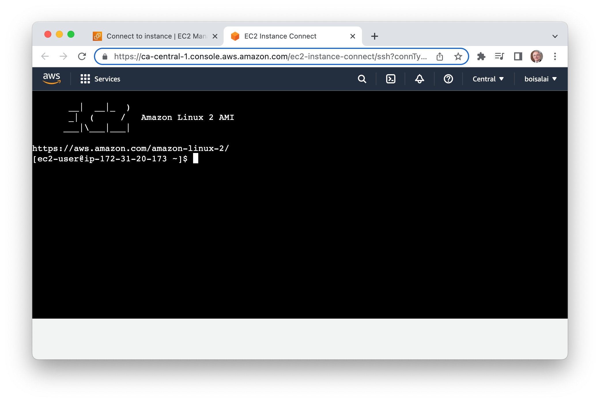

Here, we need to install a new things.
First, run an update on the machine.
After, install a few packages.

```bash
sudo yum update
pip3 install mlflow boto3 psycopg2-binary
```

To use AWS CLI, you need to make sure your AWS access key credentials are configured properly.

```bash
aws configure 
# AWS Access Key ID [****]: ****
# AWS Secret Access Key [****]: ****
# Default region name [None]: 
# Default output format [None]:
```

You will need to input your address access key, later you will be asked also to input your secret access key.
Then the default region, you can let this unchanged and also the output format you can also let the value unchanged.

To get your access keys (**Access key** and **Secret access key**), click on your account (top right of AWS Console), 
select **Security credentials** and click on **Create access key**.

Note that you can configure your AWS access with a specific profile with this command.

```bash
aws configure --profile dev
```

See [15 AWS Configure Command Examples to Manage Multiple Profiles for CLI](https://www.thegeekstuff.com/2019/03/aws-configure-examples/).

After running `aws configure`, if you run `aws s3 ls`, you should see the S3 Bucket that we created before.

```bash
aws s3 ls
# 2023-05-25 19:30:44 mlflow-artifacts-remote-bird
```

### Scenario 3 - MLflow on AWS

> [35:05](https://www.youtube.com/watch?v=1ykg4YmbFVA&list=PL3MmuxUbc_hIUISrluw_A7wDSmfOhErJK&index=14&t=2105s) Scenario 3 - MLflow on AWS

The next step will be to run the server. For that, we need to run this command.
You need to changes `DB_PASSWORD`, `DB_ENDPOINT` and `S3_BUCKET_NAME` by your own.

```bash
export DB_USER=mlflow
export DB_PASSWORD=ZziZPMko1gZr3EHuhGFq
export DB_ENDPOINT=mlflow-database.c4vbxoozdscm.ca-central-1.rds.amazonaws.com
export DB_NAME=mlflow_db
export S3_BUCKET_NAME=mlflow-artifacts-remote-bird
mlflow server -h 0.0.0.0 -p 5000 --backend-store-uri postgresql://$DB_USER:$DB_PASSWORD@$DB_ENDPOINT:5432/$DB_NAME --default-artifact-root s3://$S3_BUCKET_NAME
```

You should see something like this.

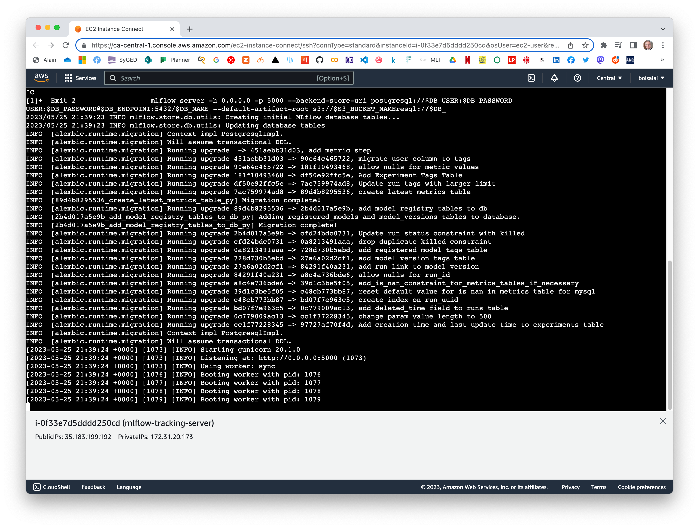

To access the tracking server from your local machine, you just need to go to your `mlflow-tracking-server` EC2 instance, and 
copy the **Public IPv4 DNS** (mine is `ec2-35-183-199-192.ca-central-1.compute.amazonaws.com`). 
Paste this IP to your web browser and add the port `:5000` like this:

```txt
ec2-35-183-199-192.ca-central-1.compute.amazonaws.com:5000
```

You should see this.

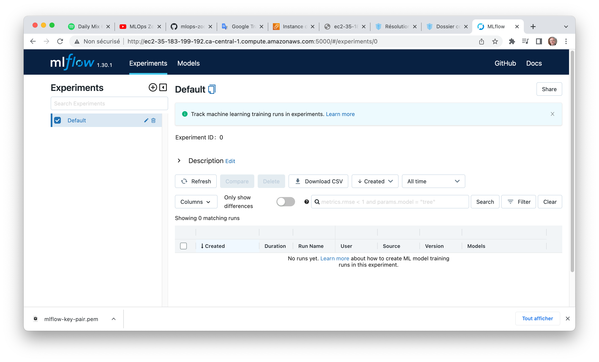

Now, you have configured MLflow to run on AWS using PostgreSQL for the backend store and using S3 Bucket for the artifacts store.
You can share this instance with other data scientists.

> 37:43

Now, go back to VS Code and scenario 3 for multiple data scientists working on multiple ML models.
See [scenario-3.ipynb](https://github.com/DataTalksClub/mlops-zoomcamp/blob/main/02-experiment-tracking/running-mlflow-examples/scenario-3.ipynb) notebook.

MLflow need to use AWS credentials to access the S3 Bucket.

The `AWS_PROFILE` is indicated in `~/.aws/config` file.

```python
import mlflow
import os

# Fill in with your AWS profile. 
# See https://docs.aws.amazon.com/cli/latest/userguide/cli-configure-files.html#cli-configure-files-using-profiles
os.environ["AWS_PROFILE"] = "" 

# Fill TRACKING_SERVER_HOST with the public DNS of the EC2 instance.
TRACKING_SERVER_HOST = "ec2-35-183-199-192.ca-central-1.compute.amazonaws.com" 
mlflow.set_tracking_uri(f"http://{TRACKING_SERVER_HOST}:5000")

print(f"tracking URI: '{mlflow.get_tracking_uri()}'")
# tracking URI: 'http://ec2-35-183-199-192.ca-central-1.compute.amazonaws.com:5000'
```

Now, list all experiments.

```python
mlflow.search_experiments()
# [<Experiment: artifact_location='s3://mlflow-artifacts-remote-bird/0', creation_time=1685050763857, 
# experiment_id='0', last_update_time=1685050763857, lifecycle_stage='active', name='Default', tags={}>]
```

> 38:54 

Run the following.

```python
from sklearn.linear_model import LogisticRegression
from sklearn.datasets import load_iris
from sklearn.metrics import accuracy_score

mlflow.set_experiment("my-experiment-1")

with mlflow.start_run():

    X, y = load_iris(return_X_y=True)

    params = {"C": 0.1, "random_state": 42}
    mlflow.log_params(params)

    lr = LogisticRegression(**params).fit(X, y)
    y_pred = lr.predict(X)
    mlflow.log_metric("accuracy", accuracy_score(y, y_pred))

    mlflow.sklearn.log_model(lr, artifact_path="models")
    print(f"default artifacts URI: '{mlflow.get_artifact_uri()}'")
```

:construction: Sorry, I stopped here at 39:00. Maybe I'll document the rest of this part 2.6 later when I have more time.

## 2.7 MLflow: benefits, limitations and alternatives

:movie_camera: [Youtube](https://www.youtube.com/watch?v=Lugy1JPsBRY&list=PL3MmuxUbc_hIUISrluw_A7wDSmfOhErJK&index=15).

### Benefits

> [00:00](https://www.youtube.com/watch?v=Lugy1JPsBRY&list=PL3MmuxUbc_hIUISrluw_A7wDSmfOhErJK&index=15&t=0s) Benefits

The tracking server can be easily deployed to the cloud. Some benefits:

* Share experiments with other data scientists.
* Collaborate with others to build and deploy models.
* Give more visibility of the data science efforts.

### Issues

> [01:23](https://www.youtube.com/watch?v=Lugy1JPsBRY&list=PL3MmuxUbc_hIUISrluw_A7wDSmfOhErJK&index=15&t=83s) Issues

Issues with running a remote (shared) MLflow server

* Security
    * Restrict access to the server (e.g. access through VPN)
* Scalibility
    * Check [Deploy MLflow on AWS Fargate](https://aws.amazon.com/blogs/machine-learning/managing-your-machine-learning-lifecycle-with-mlflow-and-amazon-sagemaker/)
    * Check [MLflow at Company Scale](https://www.youtube.com/watch?v=S27sM0K0gNw) by Jean-Denis Lesage
* Isolation
  * Define standard for naming experiments, models and a set of default tags
  * Restrict access to artifacts (e.g. use S3 buckets living in different AWS accounts)

### Limitations

> [04:37](https://www.youtube.com/watch?v=Lugy1JPsBRY&list=PL3MmuxUbc_hIUISrluw_A7wDSmfOhErJK&index=15&t=277s) Limitations

* **Authentication & Users**: The open source version of MLflow doesn't provide any sort of authentication.
* **Data versioning**: To ensure full reproducibility we need to version the data
used to train the model. MLflow doesn't provide a built-in solution for that but there are a few ways to deal with this limitation.
* **Model/Data Monitoring & Alerting**: this is outside of the scope of MLflow 
and currently there are more suitable tools for doing this.

### Alternatives

> [06:40](https://www.youtube.com/watch?v=Lugy1JPsBRY&list=PL3MmuxUbc_hIUISrluw_A7wDSmfOhErJK&index=15&t=400s) Alternatives

There are some paid alternatives to MLflow:

* [Neptune](https://neptune.ai/)
* [Comet](http://comet.ml/)
* [Weights & Biases](http://wandb.ai/) also known as WandB

See also:

* [15 Best Tools for ML Experiment Tracking and Management](https://neptune.ai/blog/best-ml-experiment-tracking-tools)
* [The Best Weights & Biases Alternatives](https://neptune.ai/blog/weights-and-biases-alternatives).

### Recap

> [11:01](https://www.youtube.com/watch?v=Lugy1JPsBRY&list=PL3MmuxUbc_hIUISrluw_A7wDSmfOhErJK&index=15&t=661s) Recap

## Additional Materials

* [Practical Deep Learning at Scale with MLflow](https://www.packtpub.com/product/practical-deep-learning-at-scale-with-mlflow/9781803241333)
* [A Guide to MLflow Talks at Data + AI Summit Europe 2020](https://www.databricks.com/blog/2020/11/05/a-guide-to-mlflow-talks-at-data-ai-summit-europe-2020.html)

## 2.8 Homework

See [questions](https://github.com/DataTalksClub/mlops-zoomcamp/blob/main/cohorts/2023/02-experiment-tracking/homework.md).


