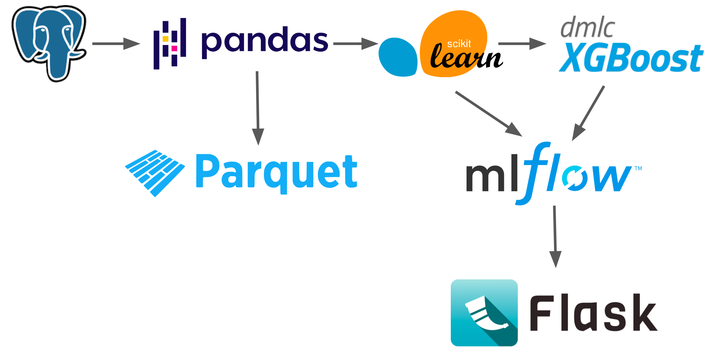
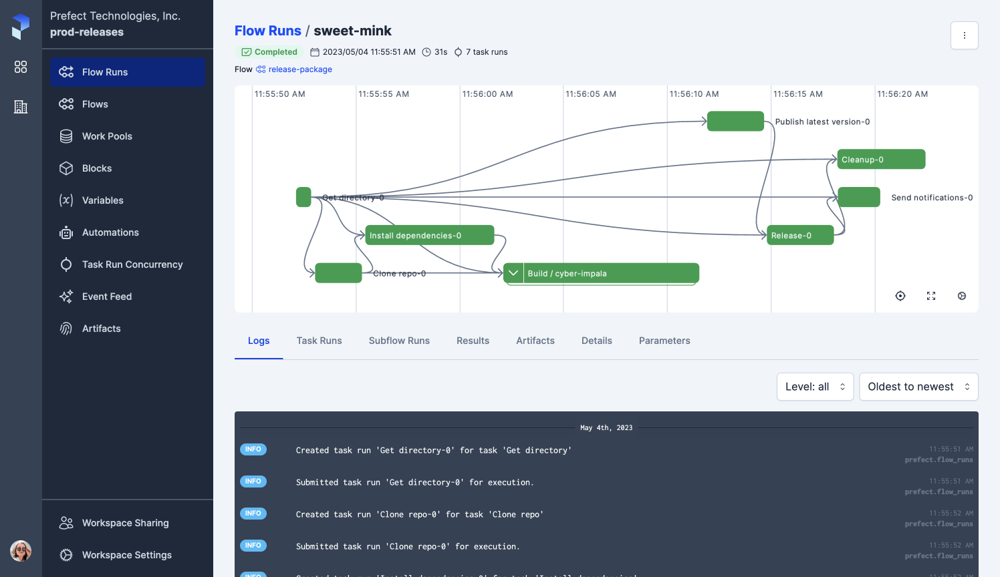

# Module 3: Orchestration and ML Pipelines

See this [GitHub page](https://github.com/DataTalksClub/mlops-zoomcamp/tree/main/03-orchestration) 
on [DataTalksClub/mlops-zoomcamp](https://github.com/DataTalksClub/mlops-zoomcamp).

In module 3, we will learn to use Prefect to orchestrate and observe our ML workflows.

## 3.1 Introdution to Workflow Orchestration

:movie_camera: [Youtube](https://www.youtube.com/watch?v=Cqb7wyaNF08&list=PL3MmuxUbc_hIUISrluw_A7wDSmfOhErJK&index=16).

Key Takeaways:

* The video discusses orchestration and machine learning (ML) pipelines with Prefect
* It introduces the concept of workflow orchestration and explains its importance for ML projects
* The challenges of working with complex systems are discussed, and how orchestration can help manage these challenges
* The benefits of using an orchestration tool like Prefect are also highlighted, including increased efficiency and reduced errors
* The video then dives into the Prefect UI tools and shows how they can help manage workflows through task visualization, error handling, and monitoring
* The video is a useful resource for anyone looking to learn more about workflow orchestration and how it can improve efficiency in ML pipelines.

### Intro to orchestration & ML pipelines with Prefect

> [00:00](https://www.youtube.com/watch?v=Cqb7wyaNF08&t=0s) - Intro to orchestration & ML pipelines with Prefect.

You might have an MLOps workflow that looks like this.



You could have:

* a database that retrieves data
* this could be picked up by a python script using pandas code to clean it up
* data is saved in a parquet file as a checkpoint, maybe readed back later
* scikit-learn used for engineering some features or running some models
* XGBoost to run a model
* MLflow can track anything saved by a database and information is written back and forth
* finally that your model is served via a [Flask](https://flask.palletsprojects.com/) or something like [FastAPI](https://fastapi.tiangolo.com/lo/)

We can have points of failure at many different parts of the workflow.

### Overview of challenges and benefits of workflow orchestration

> [02:49](https://www.youtube.com/watch?v=Cqb7wyaNF08&t=169s) - Overview of challenges and benefits of workflow orchestration.

If you give an MLOps engineer a job...

* Could you just set up this pipeline to train this model?
* Could you set up logging?
* Could you do it every day?
* Could you make it retry if it fails?
* Could you send me a message when it succeeds?
* Could you visualize the dependencies?
* Could you add caching?
* Could you add collaborators to run ad hoc - who don't code?

What is Prefect?<br>
It’s a flexible framework to build, reliably execute and observe your dataflow while supporting a wide variety of execution and data access patterns.<br>
See [Why Prefect](https://www.prefect.io/guide/blog/why-prefect/) from Anna Geller.

### Review: Prefect UI tools for complex systems and ML workflows

> [05:15](https://www.youtube.com/watch?v=Cqb7wyaNF08&t=315s) - Review: Prefect UI tools for complex systems and ML workflows.

In the Prefect UI you can quickly set up notifications, visualize run history, and schedule your dataflows.



Source: https://docs.prefect.io/2.10.12/ 

Prefect provides tools for working with comple systems so you can stop wondering about your workflows.


## 3.2 Introduction to Prefect

:movie_camera: [Youtube](https://www.youtube.com/watch?v=rTUBTvXvXvM&list=PL3MmuxUbc_hIUISrluw_A7wDSmfOhErJK&index=17).

Key Takeaways:
- The video is about Prefect and its various components.
- The video will provide an overview of Prefect terminology and show how to configure a local database.
- The process of setting up the environment and running scripts on the Prefect server will be demonstrated.
- The video will also show how to use retry logic and the workflow UI.
- Flow runs and logs in Prefect will be reviewed towards the end of the video.
- The video is suitable for those interested in learning more about Prefect and its capabilities.

### Introduction to Prefect and its components

> [00:00](https://www.youtube.com/watch?v=rTUBTvXvXvM&t=0s) - Introduction to Prefect and its components.

In this section we will see how regular python code can be converted into a perfect script and
we will run our own prefect server locally and run scripts on the server.

Goals:

* Clone GitHub repository
* Setup a conda environment
* Start a Prefect server
* Run a Prefect flow
* Checkout Prefect UI


### Overview of Prefect terminology and local database configuration

> [02:42](https://www.youtube.com/watch?v=rTUBTvXvXvM&t=162s) - Overview of Prefect terminology and local database configuration.

### Setting up environment and running scripts on Prefect server

> [05:30](https://www.youtube.com/watch?v=rTUBTvXvXvM&t=330s) - Setting up environment and running scripts on Prefect server.

### Demo of retry logic & workflow UI in action

> [10:39](https://www.youtube.com/watch?v=rTUBTvXvXvM&t=639s) - Demo of retry logic & workflow UI in action.

### Review of flow runs and logs in Prefect

> [13:55](https://www.youtube.com/watch?v=rTUBTvXvXvM&t=835s) - Review of flow runs and logs in Prefect.


## 3.3 Prefect Workflow

## 3.4 Deploying Your Workflow

## 3.5 Working with Deployments

## 3.6 Prefect Cloud (optional)

## 3.7 Homework

Coming soon!

## Quick setup

### Install packages

In a conda environment with Python 3.10.12 or similar, install all package dependencies with

```bash
git clone https://github.com/DataTalksClub/mlops-zoomcamp.git
cd mlops-zoomcamp
cd 03-orchestration 
conda create -n prefect-env python=3.10
conda activate prefect-env
pip install -r requirements.txt
```

### Start the Prefect server locally

Create another window and activate your conda environment. Start the Prefect API server locally with

```bash
prefect server start
``` 

### Alternative to self-hosted server use Prefect Cloud for added capabilties

Signup and use for free at https://app.prefect.cloud

Authenticate through the terminal with

```bash
prefect cloud login
```

Use your [Prefect profile](https://docs.prefect.io/latest/concepts/settings/) to switch between a self-hosted server and Cloud.

