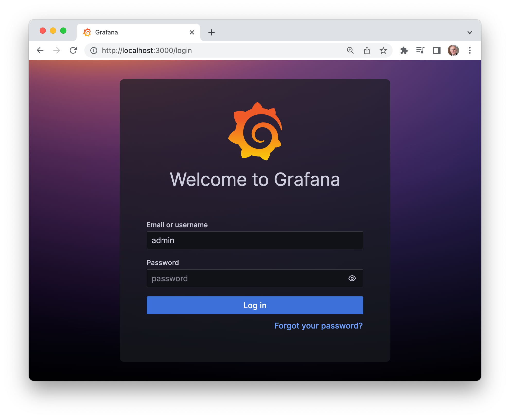
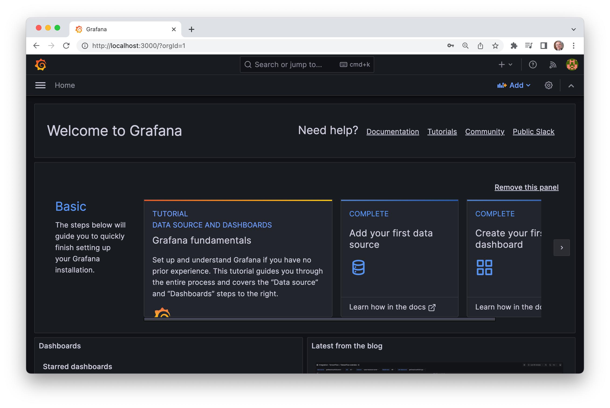
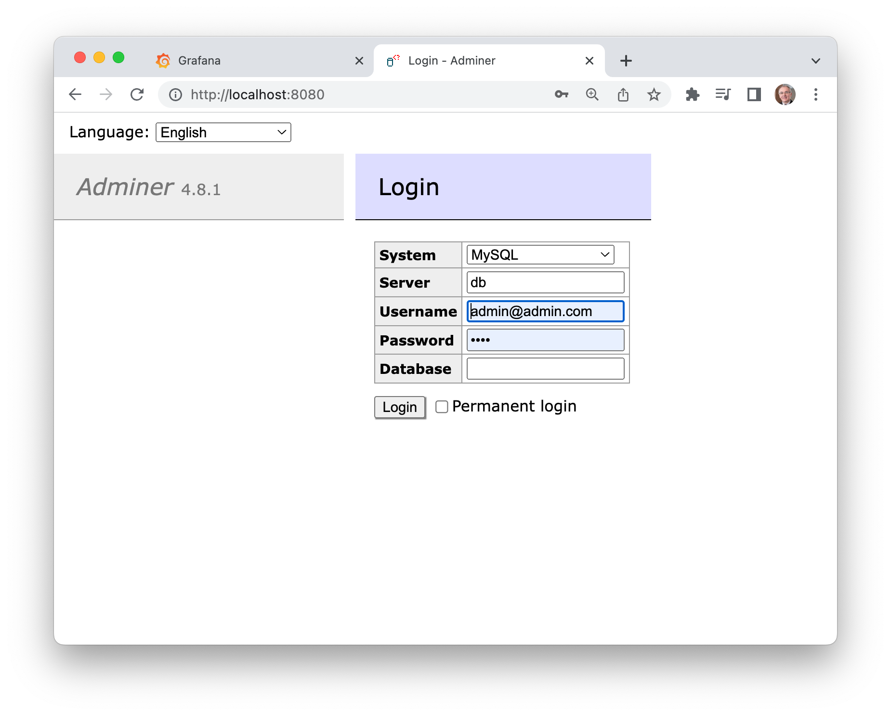
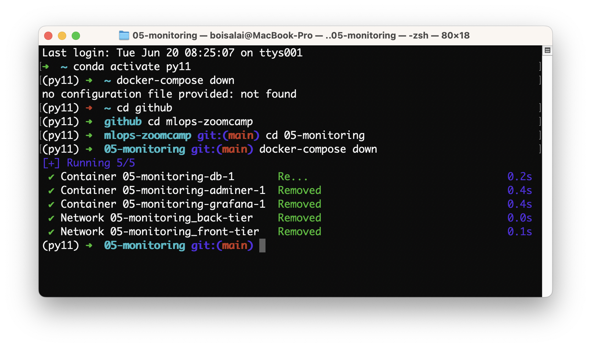
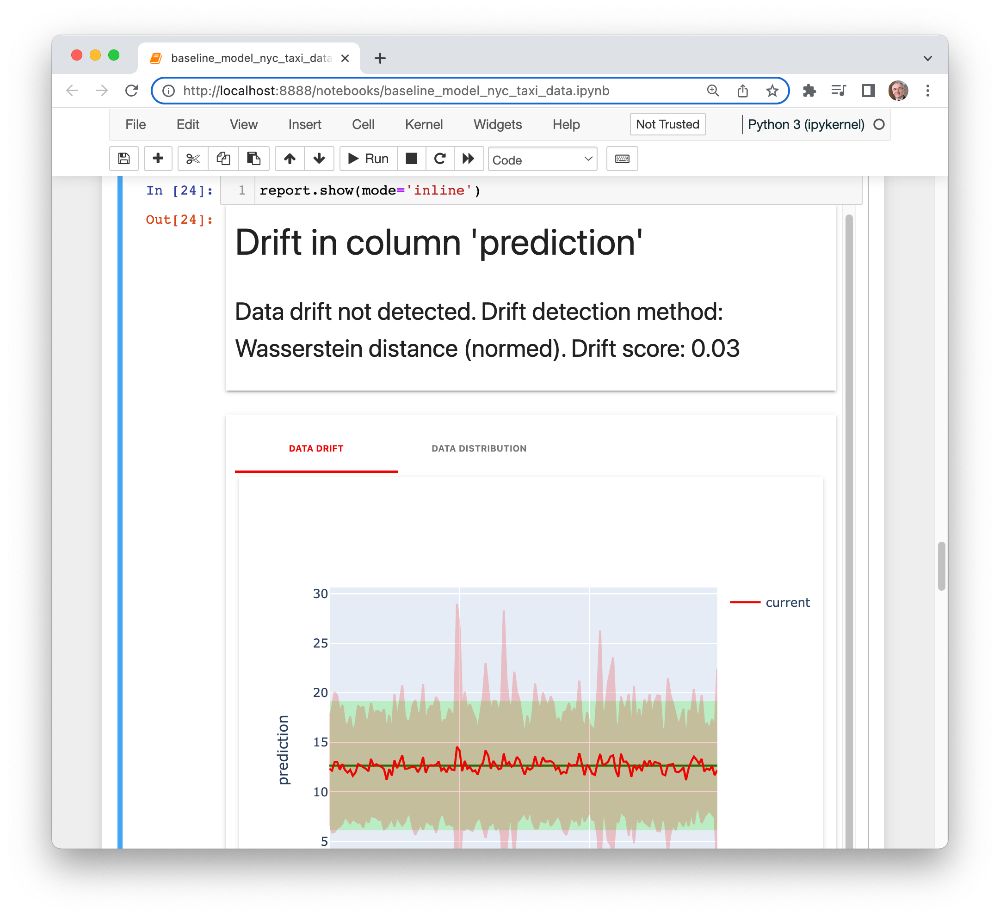
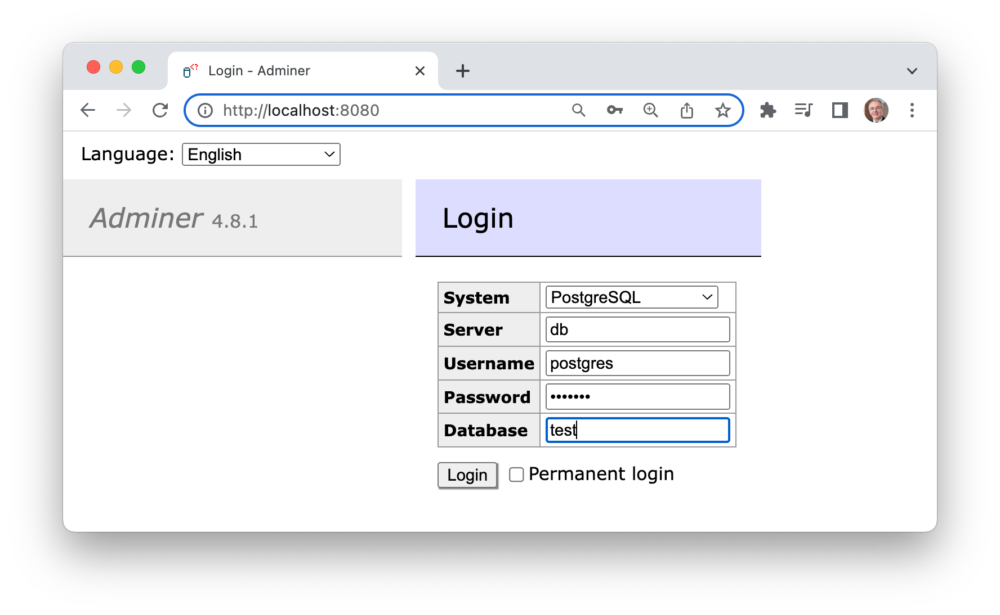

# 5. Model Monitoring

## 5.1 Intro to ML monitoring

:movie_camera: [Youtube](https://www.youtube.com/watch?v=SQ0jBwd_3kk&list=PL3MmuxUbc_hIUISrluw_A7wDSmfOhErJK&index=33)

Key Takeaways:

* The video covers the basics of monitoring machine learning models in production environments
* It discusses the importance of monitoring and the metrics used to measure performance and quality of data
* It also explores reusing existing monitoring architecture for machine learning models and introduces the concept of batch monitoring pipelines
* The video aims to provide a good understanding of how to monitor machine learning models in production environments to ensure optimal performance.

### Introduction to monitoring machine learning models in production

> [00:00](https://www.youtube.com/watch?v=SQ0jBwd_3kk&list=PL3MmuxUbc_hIUISrluw_A7wDSmfOhErJK&index=33&t=0s) Introduction to monitoring machine learning models in production.

Why monitor ML models:

Our ML production models are software deployed in production, and therefore, they face similar issues encountered by other software 
in software engineering and software development (SE/SD) domains. However, apart from these general issues, there are specific 
ML-related problems that can occur in production ML models, which are not encountered in SE/SD. Hence, relying solely on 
SE/SD tools is insufficient for monitoring production ML models.


### Metrics for model performance and data quality

> [03:00](https://www.youtube.com/watch?v=SQ0jBwd_3kk&list=PL3MmuxUbc_hIUISrluw_A7wDSmfOhErJK&index=33&t=180s) Metrics for model performance and data quality.

Monitoring ML models primarily focuses on monitoring four areas:

1. Service status: Checking the overall status of the software.
2. Model performance: Evaluating the performance based on problem-specific metrics.
3. Data quality and integrity.
4. Data drift and concept drift.

Over time, ML models can degrade due to two effects:

1. Data drift: This occurs when new input data is no longer represented by the model's training dataset. For example, 
if three new popular sites were opened in the last month, and our taxi duration model doesn't have samples of this new 
data in its training dataset.
2. Concept drift: This happens when the underlying concept changes, meaning the relationship between inputs and outputs 
has changed, even if the data itself hasn't changed. For instance, if taxi cars have been replaced with newer, faster, 
and more agile cars, our model may no longer accurately predict travel times.

In a broader context, we can also monitor four criteria:

1. Performance by segment: Assessing the model's performance in each segment of the input distribution.
2. Model bias/fairness.
3. Outliers: Identifying data points that significantly deviate from the norm.
4. Explainability: Understanding the reasoning behind the model's predictions.

### Reuse existing monitoring architecture for machine learning

> [06:06](https://www.youtube.com/watch?v=SQ0jBwd_3kk&list=PL3MmuxUbc_hIUISrluw_A7wDSmfOhErJK&index=33&t=366s) Reuse existing monitoring architecture for machine learning.

In the case of Batch Models, we incorporate batch monitoring techniques. We introduce a calculation block after each 
step in the pipeline and conduct various checks to ensure the model functions as intended. This involves:

1. Computing performance metrics and health metrics.
2. Logging the obtained metrics in a SQL or NoSQL database.
3. Generating comprehensive reports based on the collected data.

For real-time served models, it is crucial to closely monitor their performance in a live environment. To achieve this, 
we incorporate a dedicated service that continuously retrieves metrics and updates visual representations in real time.

In certain scenarios, even though the model is deployed online, it is necessary to monitor it in Batch mode as well. This is 
because some issues in the model may only become apparent over an extended period or when dealing with larger datasets, such 
as Data Drift and Concept Drift. Monitoring the model in Batch mode allows us to detect and address these issues effectively.

How to monitor?

* Add ML metrics to service health monitoring (e.g. Prometheus/Grafana)
* Build an ML-focused Dashboard(s) (e.g. MongoDB/Grafana or BI tools Tableau, Looker).

### Batch monitoring pipeline for machine learning models

> [09:14](https://www.youtube.com/watch?v=SQ0jBwd_3kk&list=PL3MmuxUbc_hIUISrluw_A7wDSmfOhErJK&index=33&t=554s) Batch monitoring pipeline for machine learning models.


## 5.2 Environment setup

:movie_camera: [Youtube](https://www.youtube.com/watch?v=yixA3C1xSxc&list=PL3MmuxUbc_hIUISrluw_A7wDSmfOhErJK&index=34)

Key Takeaways:

* The video is about creating a working environment for an application using Docker Compose
* The requirements for setting up the environment will be discussed, followed by configuring Docker Compose
* The video will also cover configuring the database and dashboarding tool within the Docker Compose configuration
* The process of creating and testing services using Docker Compose will also be explained
* The video is suitable for both beginners and experienced Docker users.

### Creating working environment, requirements, Docker Compose configuration

> [00:00](https://www.youtube.com/watch?v=yixA3C1xSxc&list=PL3MmuxUbc_hIUISrluw_A7wDSmfOhErJK&index=34&t=0s) - Creating working environment, requirements, Docker Compose configuration.

Below, the `requirements.txt` file.

```txt
prefect
tqdm
requests
joblib
pyarrow
psycopg
psycopg_binary
evidently
numpy
scikit-learn
jupyter
matplotlib
```

Run the following commands.

```bash
mkdir taxi_monitoring
cd taxi_monitoring
conda create -n py11 python=3.11
conda activate py11
pip install -r requirements.txt
```

[Install docker](https://docs.docker.com/compose/install/) and docker-compose, and start docker.

Below, a `docker-compose.yml` file.

```yaml
version: '3.7'

volumes: 
  grafana_data: {}

networks:
  front-tier:
  back-tier:

services:
  db:
    image: postgres
    restart: always
    environment:
      POSTGRES_PASSWORD: example
    ports:
      - "5432:5432"
    networks:
      - back-tier

  adminer:
    image: adminer
    restart: always
    ports:
      - "8080:8080"
    networks:
      - back-tier
      - front-tier  

  grafana:
    image: grafana/grafana
    user: "472"
    ports:
      - "3000:3000"
    volumes:
      - ./config/grafana_datasources.yaml:/etc/grafana/provisioning/datasources/datasource.yaml:ro
      # - ./config/grafana_dashboards.yaml:/etc/grafana/provisioning/dashboards/dashboards.yaml:ro
      # - ./dashboards:/opt/grafana/dashboards
    networks:
      - back-tier
      - front-tier
    restart: always
```

Create a directory config.

```bash
mkdir config
cd config
```

Below, the `config/grafana_datasources.yaml` file.

```yaml
# config file version
apiVersion: 1

# list of datasources to insert/update
# available in the database
datasources:
  - name: PostgreSQL
    type: postgres
    access: proxy
    url: db.:5432
    database: test
    user: postgres
    secureJsonData:
      password: 'example'
    jsonData:
      sslmode: 'disable'
```

Below, the `config/grafana_dashboards.yaml` file.

```yaml
apiVersion: 1

providers:
  # <string> an unique provider name. Required
  - name: 'Evidently Dashboards'
    # <int> Org id. Default to 1
    orgId: 1
    # <string> name of the dashboard folder.
    folder: ''
    # <string> folder UID. will be automatically generated if not specified
    folderUid: ''
    # <string> provider type. Default to 'file'
    type: file
    # <bool> disable dashboard deletion
    disableDeletion: false
    # <int> how often Grafana will scan for changed dashboards
    updateIntervalSeconds: 10
    # <bool> allow updating provisioned dashboards from the UI
    allowUiUpdates: false
    options:
      # <string, required> path to dashboard files on disk. Required when using the 'file' type
      path: /opt/grafana/dashboards
      # <bool> use folder names from filesystem to create folders in Grafana
      foldersFromFilesStructure: true
```

### Configuring database and dashboarding tool in Docker compose

> [03:30](https://www.youtube.com/watch?v=yixA3C1xSxc&list=PL3MmuxUbc_hIUISrluw_A7wDSmfOhErJK&index=34&t=210s) - Configuring database and dashboarding tool in Docker compose.

### Creating and testing services with Docker Compose

> [07:13](https://www.youtube.com/watch?v=yixA3C1xSxc&list=PL3MmuxUbc_hIUISrluw_A7wDSmfOhErJK&index=34&t=433s) - Creating and testing services with Docker Compose.

Build and start a Docker container with the services defined in a Docker Compose file.

```bash
docker-compose up --build
```

Open your browser to [localhost:3000](localhost:3000) to open Grafana UI. 

[Grafana](https://grafana.com/) is an open source interactive data-visualization platform, which allows users to see their data via charts and graphs that are 
unified into one dashboard (or multiple dashboards!) for easier interpretation and understanding.

The default username and password are `admin` and `admin`.
Create a new password (I use 'abcde')

You should see this.





Now, go to [localhost:8080](localhost:8080) to open Adminer UI. 

[Adminer](https://www.adminer.org/) (formerly phpMinAdmin) is a full-featured database management tool written in PHP. Conversely to phpMyAdmin, 
it consist of a single file ready to deploy to the target server. Adminer is available for MySQL, MariaDB, PostgreSQL, SQLite, MS SQL, 
Oracle, Elasticsearch, MongoDB and others via plugin.

You should see this.



## 5.3 Prepare reference and model

:movie_camera: [Youtube](https://www.youtube.com/watch?v=IjNrkqMYQeQ&list=PL3MmuxUbc_hIUISrluw_A7wDSmfOhErJK).

Key Takeaways:

* The video is about building a Graphene dashboard by creating various artifacts
* The process includes downloading and loading data, performing basic statistics, and calculating targets
* Data preprocessing and creating a baseline model will also be discussed
* The video will cover selecting features and training a linear regression model, reviewing the quality of the model, and creating a reference data set
* The video will explain each step briefly to give viewers a better understanding of the process.


### Creating artifacts for building a Graphene dashboard

> [00:00](https://www.youtube.com/watch?v=IjNrkqMYQeQ&list=PL3MmuxUbc_hIUISrluw_A7wDSmfOhErJK&index=30&t=0s) Creating artifacts for building a Graphene dashboard.

In this section, we will use [Grafana](https://grafana.com/).

Stop the `docker-container` if it is still running. Open another terminal and run the following commands.

```bash
conda activate py11
docker-compose down
```

Ypu should see this.



Create folders for models and data, and start jupyter notebook.

```bash
mkdir models
mkdir data
jupyter notebook
```

Create a new notebook (with **Python 3 (ipkernel)**) or juste open `baseline_model_nyc_taxi_data.ipynb`.

We will use [Evidently](https://docs.evidentlyai.com/) which is an open-source Python library for data scientists and ML engineers.
It helps evaluate, test, and monitor the performance of ML models from validation to production.

Baseline model for batch monitoring example.

```python
import requests
import datetime
import pandas as pd

from joblib import load, dump
from tqdm import tqdm

from sklearn.linear_model import LinearRegression
from sklearn.metrics import mean_absolute_error, mean_absolute_percentage_error
```


### Downloading and loading data, basic statistics, target calculation

> [04:55](https://www.youtube.com/watch?v=IjNrkqMYQeQ&list=PL3MmuxUbc_hIUISrluw_A7wDSmfOhErJK&index=30&t=295s) Downloading and loading data, basic statistics, target calculation.


```python
files = [('green_tripdata_2022-02.parquet', './data'), ('green_tripdata_2022-01.parquet', './data')]

print("Download files:")
for file, path in files:
    url=f"https://d37ci6vzurychx.cloudfront.net/trip-data/{file}"
    resp=requests.get(url, stream=True)
    save_path=f"{path}/{file}"
    with open(save_path, "wb") as handle:
        for data in tqdm(resp.iter_content(),
                        desc=f"{file}",
                        postfix=f"save to {save_path}",
                        total=int(resp.headers["Content-Length"])):
            handle.write(data)
```

You should see something like this.

```txt
green_tripdata_2022-02.parquet: 100%|█| 1428262/1428262 [00:04<00:00, 305911.05i
green_tripdata_2022-01.parquet: 100%|█| 1254291/1254291 [00:04<00:00, 305563.69i
```

### Data preprocessing and baseline model creation explained briefly

> [08:58](https://www.youtube.com/watch?v=IjNrkqMYQeQ&list=PL3MmuxUbc_hIUISrluw_A7wDSmfOhErJK&index=30&t=538s) Data preprocessing and baseline model creation explained briefly.


```python
jan_data = pd.read_parquet('data/green_tripdata_2022-01.parquet')

# create target
jan_data["duration_min"] = jan_data.lpep_dropoff_datetime - jan_data.lpep_pickup_datetime
jan_data.duration_min = jan_data.duration_min.apply(lambda td : float(td.total_seconds())/60)

# filter out outlires
jan_data = jan_data[(jan_data.duration_min >= 0) & (jan_data.duration_min <= 60)]
jan_data = jan_data[(jan_data.passenger_count > 0) & (jan_data.passenger_count <= 8)]
``` 

### Selecting features and training linear regression model

> [13:21](https://www.youtube.com/watch?v=IjNrkqMYQeQ&list=PL3MmuxUbc_hIUISrluw_A7wDSmfOhErJK&index=30&t=801s) Selecting features and training linear regression model.

```python
# data labeling
target = "duration_min"
num_features = ["passenger_count", "trip_distance", "fare_amount", "total_amount"]
cat_features = ["PULocationID", "DOLocationID"]

train_data = jan_data[:30000]
val_data = jan_data[30000:]

model = LinearRegression()
model.fit(train_data[num_features + cat_features], train_data[target])

train_preds = model.predict(train_data[num_features + cat_features])
train_data['prediction'] = train_preds

val_preds = model.predict(val_data[num_features + cat_features])
val_data['prediction'] = val_preds
```

### Reviewing model quality and creating reference data set

> [17:46](https://www.youtube.com/watch?v=IjNrkqMYQeQ&list=PL3MmuxUbc_hIUISrluw_A7wDSmfOhErJK&index=30&t=1066s) Reviewing model quality and creating reference data set.

```python
print(mean_absolute_error(train_data.duration_min, train_data.prediction))
print(mean_absolute_error(val_data.duration_min, val_data.prediction))
# 3.804665373785083
# 4.14206407368847
```

Dump model and reference data.

```python
with open('models/lin_reg.bin', 'wb') as f_out:
    dump(model, f_out)

val_data.to_parquet('data/reference.parquet')
```

## 5.4 Evidently metrics calculation

:movie_camera: [Youtube](https://www.youtube.com/watch?v=kP3lzh_HfWY&list=PL3MmuxUbc_hIUISrluw_A7wDSmfOhErJK&index=36)

Key Takeaways:

* The video will discuss the creation of an Evidently report and how to use it for data analysis
* It will cover the creation of the report and the metrics involved, using Evidently for data analysis, data visualization and 
interpretation of results, and code derivation for monitoring metrics in Evidently
* The video will provide a step-by-step guide on how to set up the code for monitoring and how to interpret the results
* By the end of the video, viewers will have a comprehensive understanding of how to create and utilize Evidently reports for their data analysis needs.

### Review of creation of Evidently report and metrics

> [00:00](https://www.youtube.com/watch?v=kP3lzh_HfWY&list=PL3MmuxUbc_hIUISrluw_A7wDSmfOhErJK&index=36&t=0s) Review of creation of Evidently report and metrics.

Evidently Report. See [Documentation](https://docs.evidentlyai.com/get-started/tutorial).

```python
from evidently import ColumnMapping
from evidently.report import Report
from evidently.metrics import ColumnDriftMetric, DatasetDriftMetric, DatasetMissingValuesMetric

column_mapping = ColumnMapping(
    target=None,
    prediction='prediction',
    numerical_features=num_features,
    categorical_features=cat_features
)

report = Report(metrics=[
    ColumnDriftMetric(column_name='prediction'),
    DatasetDriftMetric(),
    DatasetMissingValuesMetric()
  ]
)
```

### Explanation of how to use Evidently for data analysis

> [04:06](https://www.youtube.com/watch?v=kP3lzh_HfWY&list=PL3MmuxUbc_hIUISrluw_A7wDSmfOhErJK&index=36&t=246s) Explanation of how to use Evidently for data analysis.

```python
report.run(reference_data=train_data, current_data=val_data, column_mapping=column_mapping)

report.show(mode='inline')
```

You should see a report inside jupyter notebook.



See [Pre-built reports](https://docs.evidentlyai.com/user-guide/tests-and-reports/get-reports) for more information.

### Code derivation for monitoring metrics in Evidently

> [08:09](https://www.youtube.com/watch?v=kP3lzh_HfWY&list=PL3MmuxUbc_hIUISrluw_A7wDSmfOhErJK&index=36&t=489s) Code derivation for monitoring metrics in Evidently.

```python
result = report.as_dict()
print(result)

# prediction drift
print(result['metrics'][0]['result']['drift_score'])

# number of drifted columns
print(result['metrics'][1]['result']['number_of_drifted_columns'])

# share of missing values
print(result['metrics'][2]['result']['current']['share_of_missing_values'])
```

See [Customize JSON output](https://docs.evidentlyai.com/user-guide/customization/json-dict-output) for more information.

## 5.5 Dummy monitoring

:movie_camera: [Youtube](https://www.youtube.com/watch?v=s3G4PMsOMOA&list=PL3MmuxUbc_hIUISrluw_A7wDSmfOhErJK&index=37)

Key Takeaways:

* The video is about creating a database and tables for dummy metrics calculation
* The process involves preparing the database and creating tables with dummy data, inserting timestamp values into the database table, 
and setting up and accessing a PostgreSQL database for Grafana dashboard
* The video provides a step-by-step guide on creating a functional database and tables for dummy metrics calculation and setting up and 
accessing a PostgreSQL database for Grafana dashboard.

### Creating database and tables for dummy metrics calculation

> [00:00](https://www.youtube.com/watch?v=s3G4PMsOMOA&list=PL3MmuxUbc_hIUISrluw_A7wDSmfOhErJK&index=37&t=0s) Creating database and tables for dummy metrics calculation.

We are creatint `dummy_metrics_calculation.py`

```python
import datetime
import time
import random
import logging 
import uuid
import pytz
import pandas as pd
import io
import psycopg

logging.basicConfig(level=logging.INFO, format="%(asctime)s [%(levelname)s]: %(message)s")

SEND_TIMEOUT = 10
rand = random.Random()
```

### Database preparation and table creation with dummy data

> [03:08](https://www.youtube.com/watch?v=s3G4PMsOMOA&list=PL3MmuxUbc_hIUISrluw_A7wDSmfOhErJK&index=37&t=188s) Database preparation and table creation with dummy data.

```python
create_table_statement = """
drop table if exists dummy_metrics;
create table dummy_metrics(
  timestamp timestamp,
  value1 integer,
  value2 varchar,
  value3 float
)
"""

def prep_db():
  with psycopg.connect("host=localhost port=5432 user=postgres password=example", autocommit=True) as conn:
    res = conn.execute("SELECT 1 FROM pg_database WHERE datname='test'")
    if len(res.fetchall()) == 0:
      conn.execute("create database test;")
    with psycopg.connect("host=localhost port=5432 dbname=test user=postgres password=example") as conn:
      conn.execute(create_table_statement)

def calculate_dummy_metrics_postgresql(curr):
  value1 = rand.randint(0, 1000)
  value2 = str(uuid.uuid4())
  value3 = rand.random()

  curr.execute(
    "insert into dummy_metrics(timestamp, value1, value2, value3) values (%s, %s, %s, %s)",
    (datetime.datetime.now(pytz.timezone('Europe/London')), value1, value2, value3)
  )

def main():
  prep_db()
  last_send = datetime.datetime.now() - datetime.timedelta(seconds=10)
  with psycopg.connect("host=localhost port=5432 dbname=test user=postgres password=example", autocommit=True) as conn:
    for i in range(0, 100):
      with conn.cursor() as curr:
        calculate_dummy_metrics_postgresql(curr)

      new_send = datetime.datetime.now()
      seconds_elapsed = (new_send - last_send).total_seconds()
      if seconds_elapsed < SEND_TIMEOUT:
        time.sleep(SEND_TIMEOUT - seconds_elapsed)
      while last_send < new_send:
        last_send = last_send + datetime.timedelta(seconds=10)
      logging.info("data sent")

if __name__ == '__main__':
  main()
```

### Inserting timestamp values into database table

> [07:17](https://www.youtube.com/watch?v=s3G4PMsOMOA&list=PL3MmuxUbc_hIUISrluw_A7wDSmfOhErJK&index=37&t=437s) Inserting timestamp values into database table.

Run the script.

```bash
conda activate py11
docker-compose up --build
```

Open another terminal and run these commands.

```bash
conda activate py11
python dummy_metrics_calculation.py
```

Now let's take a look to the database.
Open your browser to [localhost:8080](localhost:8080) to open Adminer UI. 

Enter:

* **System**: PostgreSQL
* **Server**: db
* **Username**: postgres
* **Password**: example
* **Database**: test



Click on **Login** button.

You should see this.

<table>
  <tr>
    <td>
      
    </td>
    <td>
      
    </td>
  </tr>
</table>

Now, we should be able to create new dashboard.

Let's log into Grafana again.

### Setting up and accessing a PostgreSQL database for Grafana dashboard

> [10:44](https://www.youtube.com/watch?v=s3G4PMsOMOA&list=PL3MmuxUbc_hIUISrluw_A7wDSmfOhErJK&index=37&t=644s) Setting up and accessing a PostgreSQL database for Grafana dashboard.

## 5.6 Data quality monitoring

:movie_camera: [Youtube](https://www.youtube.com/watch?v=fytrmPbcLhI&list=PL3MmuxUbc_hIUISrluw_A7wDSmfOhErJK&index=44)

Key Takeaways:

* The video is about creating a daily dataset for February.
* The process involves altering a script, loading data, creating reports, and adding parameters.
* The video covers the preparation for report transformation and the transformation of the script into a Prefect pipeline with tasks.
* The viewer will learn how to build a dashboard with panels and metrics in Grafana.
* The video provides a comprehensive guide to data processing and visualization using various tools and techniques.

### Altering script, loading data, creating reports, adding parameters

> [00:00](https://www.youtube.com/watch?v=fytrmPbcLhI&list=PL3MmuxUbc_hIUISrluw_A7wDSmfOhErJK&index=38&t=0s) Altering script, loading data, creating reports, adding parameters.

Below, the `05-monitoring/evidently_metrics_calculation.py` script.

```python
import datetime
import time
import random
import logging 
import uuid
import pytz
import pandas as pd
import io
import psycopg
import joblib

from prefect import task, flow

from evidently.report import Report
from evidently import ColumnMapping
from evidently.metrics import ColumnDriftMetric, DatasetDriftMetric, DatasetMissingValuesMetric

logging.basicConfig(level=logging.INFO, format="%(asctime)s [%(levelname)s]: %(message)s")

SEND_TIMEOUT = 10
rand = random.Random()

create_table_statement = """
drop table if exists dummy_metrics;
create table dummy_metrics(
  timestamp timestamp,
  prediction_drift float,
  num_drifted_columns integer,
  share_missing_values float
)
"""

reference_data = pd.read_parquet('data/reference.parquet')
with open('models/lin_reg.bin', 'rb') as f_in:
  model = joblib.load(f_in)

raw_data = pd.read_parquet('data/green_tripdata_2022-02.parquet')

begin = datetime.datetime(2022, 2, 1, 0, 0)
num_features = ['passenger_count', 'trip_distance', 'fare_amount', 'total_amount']
cat_features = ['PULocationID', 'DOLocationID']
column_mapping = ColumnMapping(
    prediction='prediction',
    numerical_features=num_features,
    categorical_features=cat_features,
    target=None
)

report = Report(metrics = [
    ColumnDriftMetric(column_name='prediction'),
    DatasetDriftMetric(),
    DatasetMissingValuesMetric()
])

@task
def prep_db():
  with psycopg.connect("host=localhost port=5432 user=postgres password=example", autocommit=True) as conn:
    res = conn.execute("SELECT 1 FROM pg_database WHERE datname='test'")
    if len(res.fetchall()) == 0:
      conn.execute("create database test;")
    with psycopg.connect("host=localhost port=5432 dbname=test user=postgres password=example") as conn:
      conn.execute(create_table_statement)

@task
def calculate_metrics_postgresql(curr, i):
  current_data = raw_data[(raw_data.lpep_pickup_datetime >= (begin + datetime.timedelta(i))) &
    (raw_data.lpep_pickup_datetime < (begin + datetime.timedelta(i + 1)))]

  #current_data.fillna(0, inplace=True)
  current_data['prediction'] = model.predict(current_data[num_features + cat_features].fillna(0))

  report.run(reference_data = reference_data, current_data = current_data,
    column_mapping=column_mapping)

  result = report.as_dict()

  prediction_drift = result['metrics'][0]['result']['drift_score']
  num_drifted_columns = result['metrics'][1]['result']['number_of_drifted_columns']
  share_missing_values = result['metrics'][2]['result']['current']['share_of_missing_values']

  curr.execute(
    "insert into dummy_metrics(timestamp, prediction_drift, num_drifted_columns, share_missing_values) values (%s, %s, %s, %s)",
    (begin + datetime.timedelta(i), prediction_drift, num_drifted_columns, share_missing_values)
  )

@flow
def batch_monitoring_backfill():
  prep_db()
  last_send = datetime.datetime.now() - datetime.timedelta(seconds=10)
  with psycopg.connect("host=localhost port=5432 dbname=test user=postgres password=example", autocommit=True) as conn:
    for i in range(0, 27):
      with conn.cursor() as curr:
        calculate_metrics_postgresql(curr, i)

      new_send = datetime.datetime.now()
      seconds_elapsed = (new_send - last_send).total_seconds()
      if seconds_elapsed < SEND_TIMEOUT:
        time.sleep(SEND_TIMEOUT - seconds_elapsed)
      while last_send < new_send:
        last_send = last_send + datetime.timedelta(seconds=10)
      logging.info("data sent")

if __name__ == '__main__':
  batch_monitoring_backfill()
```

Run this script with the following commands.

```bash
conda activate py11
docker-compose up
```

In another terminal, run the following.

```bash
conda activate py11
python evidently_metrics_calculation.py
```

Let's take a look to our table. 

Open your browser to [localhost:8080](localhost:8080) to open Adminer UI. 

We can see that we have new table with the prediction drift.

### Creating daily dataset for February, preparing for report transformation

> [04:00](https://www.youtube.com/watch?v=fytrmPbcLhI&list=PL3MmuxUbc_hIUISrluw_A7wDSmfOhErJK&index=38&t=240s) Creating daily dataset for February, preparing for report transformation.

See the code above.

### Transforming script to Prefect pipeline with tasks

> [07:33](https://www.youtube.com/watch?v=fytrmPbcLhI&list=PL3MmuxUbc_hIUISrluw_A7wDSmfOhErJK&index=38&t=453s) Transforming script to Prefect pipeline with tasks.

See the code above.

### Building a dashboard with panels and metrics in Grafana

> [11:21](https://www.youtube.com/watch?v=fytrmPbcLhI&list=PL3MmuxUbc_hIUISrluw_A7wDSmfOhErJK&index=38&t=681s) Building a dashboard with panels and metrics in Grafana.

## 5.7 Save Grafana Dashboard

:movie_camera: [Youtube](https://www.youtube.com/watch?v=-c4iumyZMyw&list=PL3MmuxUbc_hIUISrluw_A7wDSmfOhErJK&index=45)

Key Takeaways:

* The video is about how to save and reuse Grafana dashboard configurations
* It covers step-by-step instructions on how to save a dashboard configuration in Grafana, 
how to reload Docker, and how to access the saved dashboard in Grafana
* The aim is to help viewers streamline their dashboard creation process and save time in the long run.

### Saving and reusing Grafana dashboard configurations

> [00:00](https://www.youtube.com/watch?v=-c4iumyZMyw&list=PL3MmuxUbc_hIUISrluw_A7wDSmfOhErJK&index=39&t=0s) Saving and reusing Grafana dashboard configurations.

Below, the `config/grafana_dashboards.yaml` file.

```yaml
apiVersion: 1

providers:
  # <string> an unique provider name. Required
  - name: 'Evidently Dashboards'
    # <int> Org id. Default to 1
    orgId: 1
    # <string> name of the dashboard folder.
    folder: ''
    # <string> folder UID. will be automatically generated if not specified
    folderUid: ''
    # <string> provider type. Default to 'file'
    type: file
    # <bool> disable dashboard deletion
    disableDeletion: false
    # <int> how often Grafana will scan for changed dashboards
    updateIntervalSeconds: 10
    # <bool> allow updating provisioned dashboards from the UI
    allowUiUpdates: false
    options:
      # <string, required> path to dashboard files on disk. Required when using the 'file' type
      path: /opt/grafana/dashboards
      # <bool> use folder names from filesystem to create folders in Grafana
      foldersFromFilesStructure: true
```

We also create [`05-monitoring/dashboards/data_drift.json`](https://github.com/DataTalksClub/mlops-zoomcamp/blob/main/05-monitoring/dashboards/data_drift.json).

We need to change the `docker-compose.yml`.

```yaml
  grafana:
    image: grafana/grafana
    user: "472"
    ports:
      - "3000:3000"
    volumes:
      - ./config/grafana_datasources.yaml:/etc/grafana/provisioning/datasources/datasource.yaml:ro
      - ./config/grafana_dashboards.yaml:/etc/grafana/provisioning/dashboards/dashboards.yaml:ro
      - ./dashboards:/opt/grafana/dashboards
    networks:
      - back-tier
      - front-tier
    restart: always
```

### Reloading Docker and accessing saved dashboard in Grafana

> [03:13](https://www.youtube.com/watch?v=-c4iumyZMyw&list=PL3MmuxUbc_hIUISrluw_A7wDSmfOhErJK&index=39&t=193s) Reloading Docker and accessing saved dashboard in Grafana.

## 5.8 - Debugging with test suites and reports

:movie_camera: [Youtube](https://www.youtube.com/watch?v=sNSk3ojISh8&list=PL3MmuxUbc_hIUISrluw_A7wDSmfOhErJK&index=46)

Key Takeaways:

* The video is about the use of the Evidently library for monitoring data drift and debugging.
* The presenter explains how to create reports and use data drift and test suites/presets, excluding the target column, 
running data drift tests, and visualizing results.
* The video covers how to analyze data drift using test suites and reports.
* The video explains how to create a visual dashboard for data drift analysis in Python.
* The video concludes with a farewell and gratitude to viewers of the data course.


### Debugging with Evidently library for monitoring

> [00:00](https://www.youtube.com/watch?v=sNSk3ojISh8&list=PL3MmuxUbc_hIUISrluw_A7wDSmfOhErJK&index=46&t=0s) Debugging with Evidently library for monitoring.

See [`05-monitoring/debugging_nyc_taxi_data.ipynb`](https://github.com/DataTalksClub/mlops-zoomcamp/blob/main/05-monitoring/debugging_nyc_taxi_data.ipynb).

```python
import datetime
import pandas as pd

from evidently import ColumnMapping
from evidently.report import Report
from evidently.metric_preset import DataDriftPreset

from evidently.test_suite import TestSuite
from evidently.test_preset import DataDriftTestPreset

from joblib import dump, load

from sklearn.linear_model import LinearRegression
from sklearn.metrics import mean_absolute_error, mean_absolute_percentage_error
```

Load data and model.

```python
ref_data = pd.read_parquet('data/reference.parquet')
current_data = pd.read_parquet('data/green_tripdata_2022-02.parquet')

with open('models/lin_reg.bin', 'rb') as f_in:
    model = load(f_in)

# data labeling
target = "duration_min"
num_features = ["passenger_count", "trip_distance", "fare_amount", "total_amount"]
cat_features = ["PULocationID", "DOLocationID"]

problematic_data = current_data.loc[(current_data.lpep_pickup_datetime >= datetime.datetime(2022,2,2,0,0)) & 
                               (current_data.lpep_pickup_datetime < datetime.datetime(2022,2,3,0,0))]
```

Generate Test Suite and Report.

```python
column_mapping = ColumnMapping(
    prediction='prediction',
    numerical_features=num_features,
    categorical_features=cat_features,
    target=None
)

problematic_data['prediction'] = model.predict(problematic_data[num_features + cat_features].fillna(0))

test_suite = TestSuite(tests = [DataDriftTestPreset()])
test_suite.run(reference_data=ref_data, current_data=problematic_data, column_mapping=column_mapping)
test_suite.show(mode='inline')
# Loading...

report = Report(metrics = [DataDriftPreset()])
report.run(reference_data=ref_data, current_data=problematic_data, column_mapping=column_mapping)
report.show(mode='inline')
# Loading...
```

### Create report and use data drift & test suites/presets

> [03:07](https://www.youtube.com/watch?v=sNSk3ojISh8&list=PL3MmuxUbc_hIUISrluw_A7wDSmfOhErJK&index=46&t=187s) Create report and use data drift & test suites/presets

See code above.

### Excluding Target column, running data drift test, visualizing results

> [06:56](https://www.youtube.com/watch?v=sNSk3ojISh8&list=PL3MmuxUbc_hIUISrluw_A7wDSmfOhErJK&index=46&t=416s) Excluding Target column, running data drift test, visualizing results.

### Analyzing data drift using test suites and reports

> [10:42](https://www.youtube.com/watch?v=sNSk3ojISh8&list=PL3MmuxUbc_hIUISrluw_A7wDSmfOhErJK&index=46&t=642s) Analyzing data drift using test suites and reports.

### Visual dashboard for data drift analysis in Python

> [13:42](https://www.youtube.com/watch?v=sNSk3ojISh8&list=PL3MmuxUbc_hIUISrluw_A7wDSmfOhErJK&index=46&t=822s) Visual dashboard for data drift analysis in Python.

### Farewell and gratitude to viewers of data course

> [16:43](https://www.youtube.com/watch?v=sNSk3ojISh8&list=PL3MmuxUbc_hIUISrluw_A7wDSmfOhErJK&index=46&t=1003s) Farewell and gratitude to viewers of data course.


## 5.9 Homework

More information here: TBD

## Monitoring example

### Prerequisites

You need following tools installed:

* docker
* docker-compose (included to Docker Desktop for Mac and Docker Desktop for Windows )

### Preparation

Note: all actions expected to be executed in repo folder.

* Create virtual environment and activate it (eg. `python -m venv venv && source ./venv/bin/activate or conda create -n venv python=3.11 && conda activate venv`)
* Install required packages `pip install -r requirements.txt`
* Run baseline_model_nyc_taxi_data.ipynb for downloading datasets, training model and creating reference dataset

### Monitoring Example

#### Starting services

To start all required services, execute:

```bash
docker-compose up
```

It will start following services:

* `db` - PostgreSQL, for storing metrics data
* `adminer` - database management tool
* `grafana` - Visual dashboarding tool

#### Sending data

To calculate evidently metrics with prefect and send them to database, execute:

```bash
python evidently_metrics_calculation.py
```

This script will simulate batch monitoring. Every 10 seconds it will collect data for a daily batch, cacluate metrics and insert them into 
database. This metrics will be avaliable in Grafana in preconfigured dashboard.

#### Access dashboard

* In your browser go to a `localhost:3000` The default username and password are `admin`
* Then navigate to General/Home menu and click on Home.
* In the folder General you will see New Dashboard. Click on it to access preconfigured dashboard.

#### Ad-hoc debugging

Run `debugging_nyc_taxi_data.ipynb` to see how you can perform a debugging with help of Evidently `TestSuites` and Reports

#### Stopping services

To stop all services, execute:

```bash
docker-compose down
```