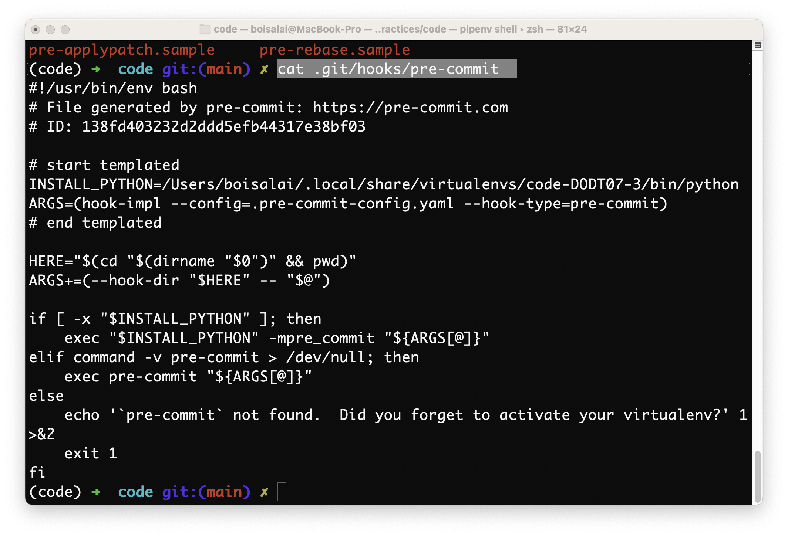
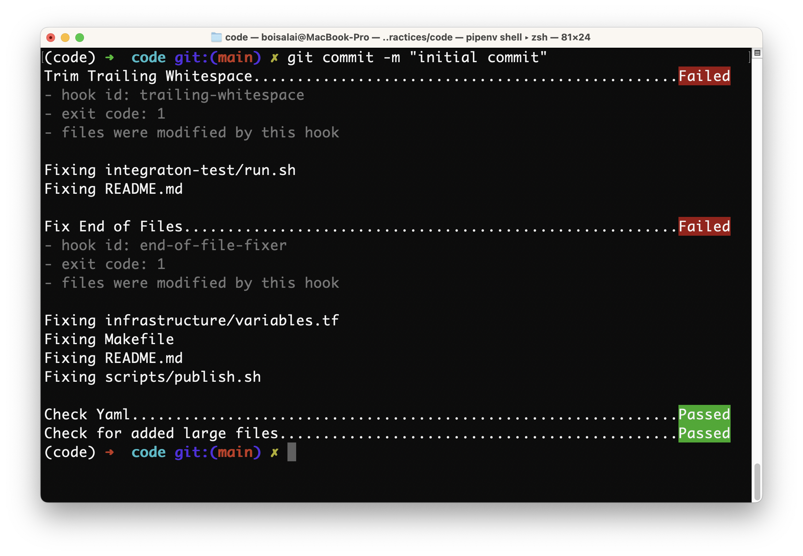
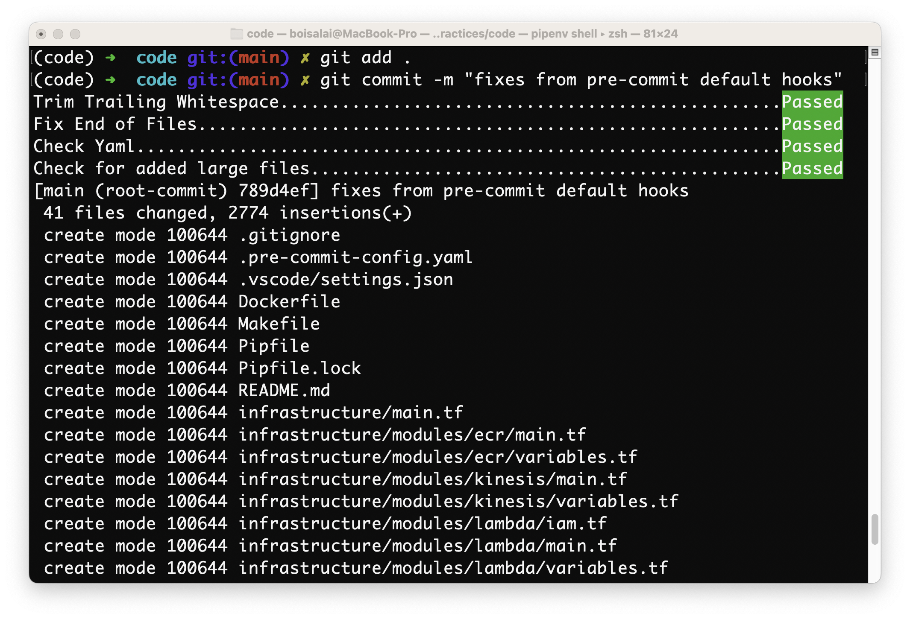

# 6A. Best Practices

In this module, we will see:

* Testing the code: unit tests with pytest
* Integration tests with Docker Compose
* Testing cloud services with LocalStack
* Code quality: linting and formatting
* Pre-commit hooks
* Makefiles
* Staging and production wnvironments
* Infrastructure as Code
* CI/CD and GitHub Actions

## 6A.1 Testing Python code with pytest

:movie_camera: [Youtube](https://www.youtube.com/watch?v=CJp1eFQP5nk&list=PL3MmuxUbc_hIUISrluw_A7wDSmfOhErJK)

We build on top of the Lambda/Kinesis example from module 4

* Introduction: Quick overview of the streaming example from module 4
* Testing the code: Unit tests with PyTest
* Integration tests with LocalStack and Docker-Compose
* Code quality: Linting, formatting and pre-commit hooks
* Makefiles
* Development, staging and production environments (theory)
* Infrastructure-as-Code with Terraform and AWS (implementing the environments)
  * Explain: Why we need to split across multiple envs
  * Demo: TF for Kinesis & Lambda, across multiple stages (staging and prod)
* Automating deplyments with CI/CD and GitHub Actions
  * Automatic deployment to stagin and manual deployment (with a click) to prod
* Cookiecutter (if we have time)
* Homework

Je devrai déinstaller pytest sur Homebrew et recommencer.

Voir [`tests/model_test.py`](https://github.com/DataTalksClub/mlops-zoomcamp/blob/main/06-best-practices/code/tests/model_test.py).

Je vois qu'il utilise or.getenv()

Dockerfile

```bash
FROM public.ecr.aws/lambda/python:3.9

RUN pip install -U pip
RUN pip install pipenv

COPY [ "Pipfile", "Pipfile.lock", "./" ]

RUN pipenv install --system --deploy

COPY [ "lambda_function.py", "model.py", "./" ]

CMD [ "lambda_function.lambda_handler" ]
```

```bash
docker build -t stream-model-duration:v2 .
```

```bash
docker run -it --rm \
    -p 8080:8080
    -e PREDICTIONS_STREAM_NAME="ride_predictions" \
    -e RUN_ID="eskjfhaskhadladgiaeopiawopfij" \
    -e TEST_RUN="True" \
    -e AWS_DEFAULT_REGION="eu-west-1" \
    stream-model-duration:v2
```

```bash
pipenv run pytest tests/
```

Je dois lire https://logankilpatrick.medium.com/what-is-langchain-and-why-should-i-care-as-a-developer-b2d952c42b28


### Introduction

> [00:00](https://www.youtube.com/watch?v=CJp1eFQP5nk&list=PL3MmuxUbc_hIUISrluw_A7wDSmfOhErJK&index=46&t=0s) Introduction

### Set Up

> [01:51](https://www.youtube.com/watch?v=CJp1eFQP5nk&list=PL3MmuxUbc_hIUISrluw_A7wDSmfOhErJK&index=46&t=111s) Set Up


`Pipfile` contain information for the dependencies of the project, and supersedes the `requirements.txt` file used in most Python projects. 
You should add a `Pipfile` in the Git repository letting users who clone the repository know the only thing required would be installing 
`Pipenv` in the machine and typing pipenv install. `Pipenv` is a reference implementation for using `Pipfile`.

See [Basic Usage of Pipenv](https://pipenv-fork.readthedocs.io/en/latest/basics.html) for more information.

Here is our `Pipfile`.

```txt
[[source]]
url = "https://pypi.org/simple"
verify_ssl = true
name = "pypi"

[packages]
boto3 = "*"
mlflow = "*"
scikit-learn = "==1.0.2"

[dev-packages]
pytest = "*"
deepdiff = "*"
pylint = "==2.14.4"
black = "*"
isort = "*"
pre-commit = "*"

[requires]
python_version = "3.9"
```

Create the environment.

```bash
cd code
pipenv install 
```

Output virtualenv information.

```bash
pipenv --venv
# /Users/boisalai/.local/share/virtualenvs/code-DODT07-3
```

Open VSCode with `code .` from the same `code` folder.

```bash
cd code
code .
```

In VSCode, open the **Command Palette** (`Ctrl+Shift+P` on Windows or `Shift+Cmd+P` on macOS) and select  
**Python: Select Interpretor**. Choose the python interpreter corresponding to that of the pipenv environment.


```bash
which python
# python not found
which pytest
# /opt/homebrew/bin/pytest
pipenv shell
# Launching subshell in virtual environment...
#  . /Users/boisalai/.local/share/virtualenvs/code-DODT07-3/bin/activate
(code) which python
# /Users/boisalai/.local/share/virtualenvs/code-DODT07-3/bin/python
which pytest
# /opt/homebrew/bin/pytest
```

?? Comment changer le path du pytest??

In VS Code, open `lambda_function.py` and click on **Testing** icon on the left menu. 
Click on **COnfigure Python Tests** button and select **pytest framnework**.


Select the directory containing the tests.

### Configure Python Tests

> [06:09](https://www.youtube.com/watch?v=CJp1eFQP5nk&list=PL3MmuxUbc_hIUISrluw_A7wDSmfOhErJK&index=46&t=369s) Configure Python Tests

### Fixing lambda function

> [09:45](https://www.youtube.com/watch?v=CJp1eFQP5nk&list=PL3MmuxUbc_hIUISrluw_A7wDSmfOhErJK&index=46&t=585s) Fixing lambda function

### On docker

> [15:00](https://www.youtube.com/watch?v=CJp1eFQP5nk&list=PL3MmuxUbc_hIUISrluw_A7wDSmfOhErJK&index=46&t=900s) On docker

### Unit test test_base64_decode

> [18:09](https://www.youtube.com/watch?v=CJp1eFQP5nk&list=PL3MmuxUbc_hIUISrluw_A7wDSmfOhErJK&index=46&t=1089s) Unit test test_base64_decode

### Unit test test_predict

> [20:58](https://www.youtube.com/watch?v=CJp1eFQP5nk&list=PL3MmuxUbc_hIUISrluw_A7wDSmfOhErJK&index=46&t=1258s) Unit test test_predict

### Unit test test_lambda_handler

> [23:44](https://www.youtube.com/watch?v=CJp1eFQP5nk&list=PL3MmuxUbc_hIUISrluw_A7wDSmfOhErJK&index=46&t=1424s) Unit test test_lambda_handler

### Add callbacks (test_run)

> [26:18](https://www.youtube.com/watch?v=CJp1eFQP5nk&list=PL3MmuxUbc_hIUISrluw_A7wDSmfOhErJK&index=46&t=1578s) Add callbacks (test_run)

### Summary

> [30:44](https://www.youtube.com/watch?v=CJp1eFQP5nk&list=PL3MmuxUbc_hIUISrluw_A7wDSmfOhErJK&index=46&t=1844s) Summary

## 6A.2 Integration tests with docker-compose

:movie_camera: [Youtube](https://www.youtube.com/watch?v=lBX0Gl7Z1ck&list=PL3MmuxUbc_hIUISrluw_A7wDSmfOhErJK&index=47)

See [`integraton-test/test_docker.py`](https://github.com/DataTalksClub/mlops-zoomcamp/blob/main/06-best-practices/code/integraton-test/test_docker.py).

Utilisez deepdiff()  https://github.com/seperman/deepdiff
pipenv install --dev deepdiff

> 20:13 

chmod +x integration-test/run.sh

The code below changes the current directory to the same one where the bash script is located.

```bash
cd "$(dirname "$0")"
``` 

> 24:29 

Install docker plugin on VS Code.

## 6A.3 Testing cloud services with LocalStack

:movie_camera: [Youtube](https://www.youtube.com/watch?v=9yMO86SYvuI&list=PL3MmuxUbc_hIUISrluw_A7wDSmfOhErJK&index=48)

We will use [LocalStack](https://github.com/localstack/localstack) that is a fully functional local AWS cloud stack. 
Develop and test your cloud & Serverless apps offline.

You can start LocalStack with [Docker Compose](https://docs.localstack.cloud/getting-started/installation/#docker-compose) by configuring a `docker-compose.yml` file. 

We can use [Kinesis](https://docs.localstack.cloud/user-guide/aws/kinesis/) with LocalStack.

> 3:00

```bash
docker-compose up kinesis
# List streams from AWS account.
aws kinesis list-streams
# List streams from LocalStack.
aws --endpoint-url=http://localhost:4566 kinesis list-streams
```

> 4:59

```bash
aws --endpoint-url=http://localhost:4566 kinesis create-stream help
aws --endpoint-url=http://localhost:4566 \
    kinesis create-stream \
    --stream-name ride_predictions \
    --shard-count 1
```

> 6:33 

See [`integraton-test/docker-compose.yaml`](https://github.com/DataTalksClub/mlops-zoomcamp/blob/main/06-best-practices/code/integraton-test/docker-compose.yaml).

## 6A.4 Code quality: linting and formatting

:movie_camera: [Youtube](https://www.youtube.com/watch?v=uImvWE-iSDQ&list=PL3MmuxUbc_hIUISrluw_A7wDSmfOhErJK&index=49)

See:

* [PEP 8 – Style Guide for Python Code](https://peps.python.org/pep-0008/)  is a document that provides guidelines and best practices on how to write Python code.
* [Pylint](https://github.com/pylint-dev/pylint) is a static code analysis tool for the Python programming language.
* [Pylint documentation](https://pylint.readthedocs.io/en/latest/)

```bash
pipenv install --dev pylint=2.17.4
```

We can create a `.pylintrc` file to disabled some warnings.

> 9:46

`pyproject.toml`

See [tests/model_test.py](06-best-practices/code/tests/model_test.py).

> 20:47 Black and isort

Avec Prefect, faire un git commit avant d'exécuter bl;ack and isort.
git commit -m ""

```bash
black --skip-string-normalization --diff . | less
black --skip-string-normalization
black .
```

See [`code/pyproject.toml`](https://github.com/DataTalksClub/mlops-zoomcamp/blob/main/06-best-practices/code/pyproject.toml)

> 27:56

```bash
pylint --recursive=y .
isort --help
isort diff . | less
isort .
```

> 31:47

Run the following commands in that order.

```bash
isort .
black .
pylint --recursive=y .
pytest tests/
```

After that, we can commit.

## 6A.5 Git pre-commit hooks

:movie_camera: [Youtube](https://www.youtube.com/watch?v=lmMZ7Axk2T8&list=PL3MmuxUbc_hIUISrluw_A7wDSmfOhErJK)

Without makefiles:

```bash
isort .
black .
pylint --recursive=y .
pytest tests/
```

[Git Hooks](https://git-scm.com/book/en/v2/Customizing-Git-Git-Hooks) are shell scripts found in the hidden `.git/hooks` 
directory of a Git repository. These scripts trigger actions in response to specific events, 
so they can help you automate your development lifecycle. 
Although you may never have noticed them, every Git repository includes sample scripts (in the `.git/hooks/` folder).

```bash
$ ls -la
$ cd .git
$ ls
FETCH_HEAD  config      hooks       info        logs        packed-refs
HEAD        description index       lfs         objects     refs
$ cd hooks
applypatch-msg.sample     post-merge                pre-push                  push-to-checkout.sample
commit-msg.sample         post-update.sample        pre-push.sample           update.sample
fsmonitor-watchman.sample pre-applypatch.sample     pre-rebase.sample
post-checkout             pre-commit.sample         pre-receive.sample
post-commit               pre-merge-commit.sample   prepare-commit-msg.sample
```

[pre-commit](https://pre-commit.com/) is a framework for managing and maintaining multi-language pre-commit hooks.

```bash
pwd
which python
pipenv install --dev pre-commit
```

> 0:02:51 - Run pre-commit hooks for specific folder.

Suppose we want pre-commit only for specific folder.

```bash
$ pwd
/Users/boisalai/github/mlops-zoomcamp/06-best-practices/code
$ git init
Initialized empty Git repository in /Users/boisalai/GitHub/mlops-zoomcamp/06-best-practices/code/.git/
$ ls -a
.                       Makefile                model.py
..                      Pipfile                 plan.md
.git                    Pipfile.lock            pyproject.toml
.gitignore              README.md               scripts
.pre-commit-config.yaml infrastructure          tests
.vscode                 integraton-test
Dockerfile              lambda_function.py
```

Create `.pre-commit-config.yaml` file.

```bash
$ pre-commit sample-config > .pre-commit-config.yaml
$ cat .pre-commit-config.yaml
# See https://pre-commit.com for more information
# See https://pre-commit.com/hooks.html for more hooks
repos:
-   repo: https://github.com/pre-commit/pre-commit-hooks
    rev: v3.2.0
    hooks:
    -   id: trailing-whitespace
    -   id: end-of-file-fixer
    -   id: check-yaml
    -   id: check-added-large-files
```

Run `pre-commit install` to install pre-commit into your git hooks.

```bash
$ pre-commit install
pre-commit installed at .git/hooks/pre-commit
$ ls .git/hooks/
applypatch-msg.sample     pre-commit                pre-receive.sample
commit-msg.sample         pre-commit.sample         prepare-commit-msg.sample
fsmonitor-watchman.sample pre-merge-commit.sample   push-to-checkout.sample
post-update.sample        pre-push.sample           update.sample
pre-applypatch.sample     pre-rebase.sample
$ cat .git/hooks/pre-commit  
```

You should see this.



Create `.gitignore` file with this content.

```bash
__pycache__
```

After run the following commands.

```bash
$ git status
$ git add .
$ git commit -m "initial commit"
```

You should see this.



Run the following commands to see what has changed.

```bash
$ git status
$ git diff
```

After, run the following commands.

```bash
$ git add .
$ git commit -m "fixes from pre-commit default hooks"
```

You should see this.



See https://pre-commit.com/hooks.html for more hooks

## 6A.6 Makefiles and make

## 6A.7 Homework
